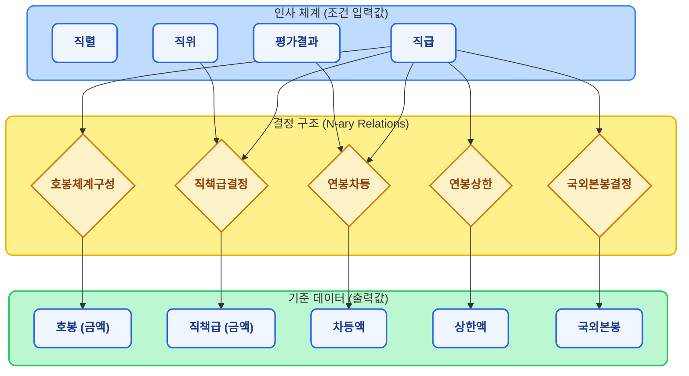

# 한국은행 보수규정 하이브리드 AI 에이전트

한국은행 보수규정 PDF를 기반으로, 지식 그래프 + Context RAG + ReAct 에이전트를 결합한 질의응답 시스템.
순수 RAG로는 불가능한 **수치 계산, 다단계 추론, 규정 간 우선순위 판단**을 해결한다.

---

## 빠른 시작 (Quick Start)

### 1. 사전 준비

| 항목 | 비고 |
|------|------|
| Docker Desktop | TypeDB, Neo4j 컨테이너 구동용. 없으면 Context RAG만 테스트 가능 |
| Python 3.9+ | 없으면 `setup.sh`가 Homebrew로 자동 설치 시도 |

### 2. LLM 엔드포인트 설정

`.env.example`을 복사해서 `.env`를 만들고, **사용할 LLM 엔드포인트만 수정**하면 된다.

```bash
cp .env.example .env
```

`.env` 핵심 설정:
```env
# 메인 추론 모델 (HCX 역할)
OPENAI_BASE_URL=https://your-llm-endpoint/v1
OPENAI_MODEL=your-model-name
OPENAI_API_KEY=your-api-key

# DB 쿼리 전문 모델 (Qwen 역할, 미설정 시 메인 모델 사용)
QWEN_BASE_URL=https://your-qwen-endpoint/v1
QWEN_MODEL=your-qwen-model-name
QWEN_API_KEY=your-qwen-api-key
```

> OpenAI-compatible API(`/v1/chat/completions`)를 지원하는 엔드포인트면 어떤 모델이든 연결 가능.
> vLLM, Ollama, LiteLLM, Azure OpenAI 등 모두 호환된다.

### 3-A. 전체 설치 (Graph DB 포함)

```bash
chmod +x setup.sh && ./setup.sh
```

이 스크립트가 자동으로 수행하는 작업:
1. Docker로 TypeDB(포트 1729) + Neo4j(포트 7474/7687) 컨테이너 기동
2. Python 가상환경 생성 및 전체 의존성 설치
3. TypeDB/Neo4j에 보수규정 스키마 생성 및 데이터 적재

### 3-B. Context RAG만 테스트 (Docker 불필요)

Graph DB 없이 Context RAG 모드만 테스트하려면:

```bash
python3 -m venv .venv
source .venv/bin/activate
pip install -e ".[llm,demo]"
```

### 4. 웹 UI 실행

```bash
source .venv/bin/activate
streamlit run app.py --server.port 8088
```

브라우저에서 `http://localhost:8088` 접속. 사이드바에서 테스트할 아키텍처를 선택하고 질문을 입력하면 된다.

---

## 시스템 아키텍처

### 전체 흐름

```
사용자 질문
    │
    ▼
┌─────────────────────────────────────────────────┐
│              Streamlit UI (app.py)               │
│  아키텍처 선택: TypeDB / Neo4j / Context / Base  │
└────┬──────────┬──────────┬──────────┬────────────┘
     │          │          │          │
     ▼          ▼          ▼          ▼
  TypeDB     Neo4j     Context    Base LLM
  Agent      Agent      RAG      (비교용)
     │          │          │
     ▼          ▼          ▼
┌─────────┐ ┌─────────┐ ┌──────────────────┐
│ HCX LLM │ │ HCX LLM │ │    HCX LLM       │
│ (메인)   │ │ (메인)   │ │ 전처리 문서 전체  │
│    │     │ │    │     │ │ → 1-step QA      │
│    ├─────┤ │    ├─────┤ └──────────────────┘
│ Tool1:   │ │ Tool1:   │
│ ask_db   │ │ ask_db   │
│ _expert  │ │ _expert  │
│ (Qwen)   │ │ (Qwen)   │
│  → TypeQL│ │  → Cypher│
│    │     │ │    │     │
│ Tool2:   │ │ Tool2:   │
│ search_  │ │ search_  │
│ regulations│ │ regulations│
│ (Context │ │ (Context │
│  섹션검색)│ │  섹션검색)│
└─────────┘ └─────────┘
```

### MoE (Mixture of Experts) 구조

시스템은 두 개의 LLM을 역할 분담시킨다:

| 역할 | 담당 | 하는 일 |
|------|------|---------|
| **HCX** (메인 에이전트) | `OPENAI_*` 환경변수 | 질문 의도 파악, 도구 호출 판단, 규정 텍스트 해석, 최종 답변 생성 |
| **Qwen** (DB 서브에이전트) | `QWEN_*` 환경변수 | HCX가 `ask_db_expert` 도구를 호출하면, TypeQL/Cypher 쿼리를 생성하여 DB에서 수치를 조회 |

HCX가 사용하는 도구 2개:
- **`ask_db_expert(question)`** — 자연어로 Qwen에게 수치 조회 요청 (예: "3급 팀장 직책급은?")
- **`search_regulations(keyword)`** — 전처리 문서에서 관련 규정 텍스트 검색 (예: "임금피크제 지급률")

### ReAct + Reflection 루프

```
HCX: 질문 분석 → "직책급 수치가 필요하다" (Reasoning)
  → ask_db_expert("3급 팀장 직책급") 호출 (Acting)
    → Qwen: TypeQL 생성 → DB 실행 → 1,956,000원 반환
HCX: "계산 공식이 필요하다" (Reasoning)
  → search_regulations("연봉제본봉 조정") 호출 (Acting)
    → 관련 규정 텍스트 3개 섹션 반환
HCX: 수치 + 규정을 종합하여 최종 답변 생성
```

에이전트가 잘못된 쿼리를 작성하면 에러 메시지를 보고 스스로 수정하여 재시도한다 (Self-Correction).

---

## 디렉토리 구조

```
├── app.py                          # Streamlit UI 엔트리포인트
├── .env.example                    # 환경변수 템플릿 (LLM, DB 연결 설정)
├── setup.sh                        # 원클릭 설치 스크립트
├── docker-compose.yml              # TypeDB + Neo4j 컨테이너 정의
├── pyproject.toml                  # Python 패키지 및 의존성 정의
│
├── src/
│   ├── bok_compensation_typedb/    # TypeDB 백엔드
│   │   ├── agent.py                #   ReAct 에이전트 (HCX+Qwen MoE)
│   │   ├── config.py               #   TypeDB 연결 설정
│   │   ├── connection.py           #   TypeDB 드라이버 초기화
│   │   ├── create_db.py            #   데이터베이스 생성
│   │   ├── load_schema.py          #   .tql 스키마 로딩
│   │   ├── insert_data.py          #   규정 데이터 적재 (~48KB)
│   │   ├── llm_template.py         #   LLM 팩토리 (env 기반, 커밋 대상)
│   │   ├── llm.py                  #   LLM 실제 설정 (gitignored, API 키 포함)
│   │   ├── question_validation.py  #   질문 사전 검증 (불가능한 조건 필터링)
│   │   └── check_db.py             #   DB 상태 확인 유틸리티
│   │
│   ├── bok_compensation_neo4j/     # Neo4j 백엔드 (TypeDB와 동일 인터페이스)
│   │   ├── agent.py                #   ReAct 에이전트 (HCX+Qwen MoE)
│   │   ├── config.py               #   Neo4j 연결 설정
│   │   ├── schema_seeder.py        #   스키마 생성 및 시딩
│   │   └── insert_data.py          #   규정 데이터 적재 (~48KB)
│   │
│   ├── bok_compensation_context/   # Context RAG 백엔드 (Graph DB 불필요)
│   │   ├── context_query.py        #   전처리 문서 기반 QA 로직
│   │   ├── langgraph_query.py      #   LangGraph 통합
│   │   └── regulation_context.md   #   전처리된 규정 문서 (698줄, ~31KB)
│   │
│   └── bok_compensation/
│       └── hybrid_router_graph.py  #   하이브리드 라우터 (시뮬레이션)
│
├── schema/
│   └── compensation_regulation.tql # TypeDB 스키마 정의
│
├── tests/
│   └── validate_data.py            # DB 데이터 vs PDF 원본 검증 (50+ 항목)
│
└── docs/
    ├── 보수규정 전문(20250213).pdf  # 원천 규정 문서
    ├── schema_diagram.md           # TypeDB 스키마 상세 다이어그램
    ├── context_preprocessing_guide.md
    └── system_improvements/
```

---

## 데이터 흐름 상세

### 원천 데이터 → 시스템

```
보수규정 PDF (docs/보수규정 전문.pdf)
    │
    ├──→ insert_data.py ──→ TypeDB (구조화된 지식 그래프)
    │                         엔티티: 직급, 직위, 호봉, 평가결과 등
    │                         관계: 호봉체계구성, 직책급결정, 연봉차등 등
    │
    ├──→ insert_data.py ──→ Neo4j (LPG 기반 지식 그래프)
    │                         노드: JobGrade, BaseSalary, DutyAllowance 등
    │                         관계: HAS_BASE_SALARY, HAS_DUTY_ALLOWANCE 등
    │
    └──→ regulation_context.md (전처리 마크다운)
                              조문 텍스트 + JSON 수치 테이블
                              Context RAG가 직접 참조
```

### TypeDB 지식 그래프 스키마



---

## 3가지 백엔드 비교

| | Context RAG | Neo4j Agent | TypeDB Agent |
|---|---|---|---|
| **Graph DB 필요** | 불필요 | 필요 | 필요 |
| **동작 방식** | 전처리 문서 전체를 LLM에 전달하여 1-step QA | HCX가 Qwen에게 Cypher 쿼리 요청 + 텍스트 검색 | HCX가 Qwen에게 TypeQL 쿼리 요청 + 텍스트 검색 |
| **단순 조문 조회** | 우수 | 우수 | 우수 |
| **수치 계산** | 환각 위험 | 우수 | 매우 우수 |
| **복합 조건 판단** | 미흡 | 우수 | 매우 우수 |
| **장점** | 구축 간단, DB 불필요 | 직관적 그래프 모델, 시각화 | 엄격한 온톨로지로 잘못된 쿼리 사전 차단 |
| **한계** | 표 간 교차 계산 시 숫자 오류 | 복잡한 N-ary 관계에서 Cypher 문법 오류 가능 | 추론 루프가 깊으면 타임아웃 가능 |

---

## 예시 질문 및 기대 정답

| # | 난이도 | 질문 | 기대 정답 |
|---|--------|------|-----------|
| Q1 | 하 | G5 직원의 초봉은? | 초임호봉 11호봉, 본봉 1,554,000원 |
| Q2 | 하 | 팀장 3급 직책급은? | 연간 1,956,000원 |
| Q3 | 하 | 미국 주재 2급 직원의 국외본봉은? | 월 9,760 USD |
| Q4 | 중 | 현재 연봉제 본봉이 7천만원이고 3급 EE이면 조정 후 본봉은? | 72,016,000원 (= 70,000,000 + 차등액 2,016,000) |
| Q5 | 상 | 본봉 7,700만원인 3급 EE 직원이 상한을 넘는가? | 79,016,000원 > 상한 77,724,000원 → 초과 |
| Q6 | 중 | 기한부 고용계약자는 상여금을 받을 수 있나? | 받을 수 없다 (제14조, 제2장·제3장 적용 제외) |
| Q7 | 하 | 임금피크제 적용 대상과 연차별 지급률은? | 잔여근무기간 3년 이하. 1년차 0.9, 2년차 0.8, 3년차 0.7 |

---

## 환경 설정 상세

### `.env` 전체 항목

```env
# ── LLM 메인 모델 (HCX 역할) ──
LLM_PROVIDER=openai-compatible          # openai-compatible 또는 ollama
OPENAI_BASE_URL=https://your-endpoint/v1
OPENAI_MODEL=your-model-name
OPENAI_API_KEY=your-api-key

# ── Qwen DB 서브에이전트 (미설정 시 메인 모델 폴백) ──
QWEN_BASE_URL=https://your-qwen-endpoint/v1
QWEN_MODEL=your-qwen-model-name
QWEN_API_KEY=your-qwen-api-key

# ── Ollama 사용 시 (LLM_PROVIDER=ollama) ──
# OLLAMA_URL=http://localhost:11434
# OLLAMA_MODEL=qwen2.5-coder:14b-instruct

# ── TypeDB ──
TYPEDB_ADDRESS=127.0.0.1:1729
TYPEDB_DATABASE=bok-compensation-regulations

# ── Neo4j ──
NEO4J_URI=bolt://localhost:7687
NEO4J_USERNAME=neo4j
NEO4J_PASSWORD=password
```

### LLM 엔드포인트 요구사항

- OpenAI-compatible API (`POST /v1/chat/completions`) 지원 필수
- Tool calling (function calling) 지원 필수 (TypeDB/Neo4j Agent 모드)
- Context RAG 모드는 tool calling 없이도 동작

### 의존성 그룹

```bash
pip install -e ".[full]"    # 전체 (TypeDB + Neo4j + LLM + Streamlit + pytest)
pip install -e ".[llm,demo]" # Context RAG + Streamlit만 (Graph DB 불필요)
pip install -e ".[dev]"      # pytest만
```

---

## 테스트

### 데이터 검증 (DB 데이터 vs PDF 원본)

```bash
PYTHONPATH=src python tests/validate_data.py typedb   # TypeDB 검증
PYTHONPATH=src python tests/validate_data.py neo4j    # Neo4j 검증
PYTHONPATH=src python tests/validate_data.py all      # 전체 검증
```

50개 이상의 수치를 PDF 원본 대비 자동 검증한다.

### pytest

```bash
PYTHONPATH=src pytest tests/
```

---

## 기술 스택

| 영역 | 기술 |
|------|------|
| 지식 그래프 | TypeDB 3.x (N-ary Hypergraph), Neo4j 5.x (LPG) |
| 에이전트 프레임워크 | LangGraph (ReAct + Reflection) |
| LLM 통합 | LangChain (OpenAI-compatible, Ollama) |
| 웹 UI | Streamlit |
| 컨테이너 | Docker Compose |
| 원천 데이터 | 한국은행 보수규정 전문 (2025.02.13) |
