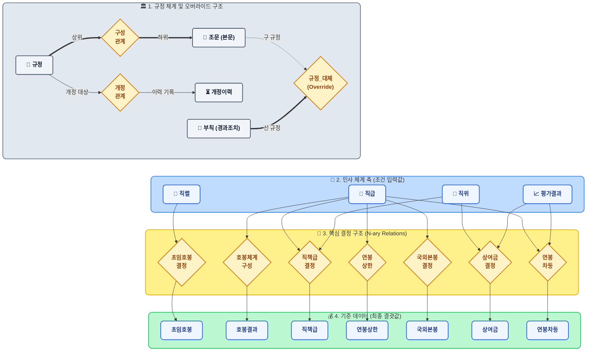
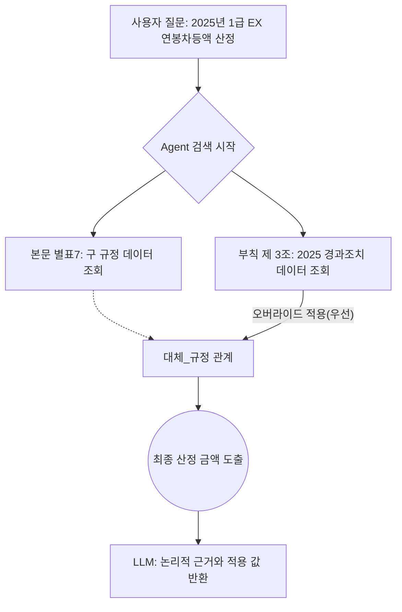

# 🏦 한국은행 보수규정 하이브리드 AI 에이전트 구축 결과 보고서

## 📖 1. 프로젝트 개요 (Overview)
본 프로젝트는 한국은행 임직원의 보수 및 인사 규정과 같이 **복잡한 사규와 수치 계산이 혼재된 도메인**에서 완벽한 질의응답을 제공하는 대화형 AI 도우미를 구축하는 것을 목표로 합니다. 단순한 텍스트 검색(RAG)의 한계를 극복하기 위해 **지식 그래프(Knowledge Graph)**와 **ReAct(Reasoning and Acting) 기반의 LangGraph 자율 에이전트**를 결합한 최신 AI 아키텍처를 도입하여 테스트 프레임워크를 수립하고 성능을 검증했습니다.

### 🔗 1.1. 원천 규정 데이터
본 시스템의 지식 그래프 및 RAG 구축을 위해 사용된 원천 데이터(Source Document)는 다음과 같습니다.
* **원천 문서 링크**: [한국은행 보수규정 전문(20250213)](docs/보수규정%20전문(20250213).pdf)

### 🗺️ 1.2. TypeDB 지식 그래프 스키마(Schema) 설계 리뷰
복잡한 한국은행의 규정 체계와 인사/보수 기준표를 AI가 오차 없이 추론할 수 있도록 N-ary 기반의 하이퍼그래프(TypeDB)로 모델링했습니다. 이를 통해 *'규정-조문'*의 법문 구조, *'직렬-직급-직위'*의 인사 체계, 그리고 이들의 교차로 결정되는 *'수당/호봉/상여금'* 기준표가 유기적으로 연결됩니다.

> 상세한 스키마 다이어그램, 엔티티 설명 및 에이전트의 실제 질의 파싱 경로(Query Path) 예시는 **[docs/schema_diagram.md](docs/schema_diagram.md)** 문서에서 확인하실 수 있습니다.

---

## 🧠 2. 도입 기술 및 핵심 아키텍처

### 📊 2.1. Temporal-Aware Knowledge Graph (TypeDB / Neo4j)
텍스트로 표현하기 어려운 각종 보수 기준(호봉표, 연봉 차등액표, 직위별 직책급 등)과 제약 조건을 그래프 데이터베이스(TypeDB, Neo4j)에 구조화했습니다.
- **Neo4j:** 노드(Node)와 관계(Relationship)의 직관적인 연결로 수당 및 급여 체계를 표현.
- **TypeDB:** 보다 엄격한 타입 시스템(TypeQL)을 사용하여 엔티티, 관계, 속성을 온톨로지(Ontology) 형태로 강력히 규제하여 잘못된 데이터 삽입과 무의미한 추론을 방지.

### 🔄 2.2. ReAct 및 Reflection(비판적 회고) 기반 LangGraph 엔진
AI 모델이 사용자의 질문을 받으면 **어떤 도구를 사용해야 할지 스스로 추론(Reasoning)하고 행동(Acting)** 하도록 설계했습니다.
- **문서 검색 도구(`search_regulations`)**: 법률 조문, 처벌, 감액 규정 등 "텍스트" 해석 필요시 사용.
- **그래프 질의 도구(`execute_typeql` / `execute_cypher`)**: 정확한 급여 숫자를 "행과 열" 구조에서 찾아야 할 때 사용.
- **Reflection (비판적 회고)**: Agent가 쿼리 작성에 실패하거나 틀린 스키마를 참조했을 때 오류 메시지(`Observation`)를 즉각 분석하고, **왜 실패했는지 스스로 파악하여 수정된 쿼리로 재시도(__Self-Correction__)** 하는 회고 사이클을 LangGraph Edge에 융합했습니다.

### 🔍 2.3. Hybrid RAG (Graph Data + Vector Search)
언어 모델(LLM)이 단순히 긴 컨텍스트(Context)를 읽고 환각(Hallucination)으로 답변을 만들어 내지 않게 하기 위해, 명확한 수치는 지식 그래프에서, 절차적 실무 텍스트는 컨텍스트 매칭 RAG에서 동시에 가져와 최종 답변을 생성하도록 조율(Orchestration)했습니다.

### 🤝 2.4. MoE (Mixture of Experts) 기반 LLM 모델 분업 (HCX & Qwen)
본 시스템은 에이전트의 안정성과 정확도를 극대화하기 위해 각 LLM의 강점을 살린 **MoE(Mixture of Experts) 기반 역할 분담 아키텍처**를 도입했습니다.
- **HCX (메인 추론 및 Context RAG):** 뛰어난 한국어 자연어 이해력과 종합적 사고를 바탕으로 메인 에이전트로 역할을 수행합니다. 질문의 의도를 파악하고, 규정 텍스트 문맥(Context)을 분석하며, 취합된 데이터를 바탕으로 최종적이고 논리적인 답변을 생성합니다.
- **Qwen (Graph DB Query Sub-Agent):** TypeQL 및 Cypher와 같이 엄격한 문법이 요구되는 그래프 DB 쿼리 생성 전담 서브 에이전트로 동작합니다. *A/B 테스트 결과, Qwen은 복잡한 다대다(N-ary) 관계 구조(예: `호봉체계구성` 릴레이션 매핑)를 정확히 탐색하고 마크다운 포맷팅 오류 없는 순수 코드를 생생하는 데 있어 매우 뛰어난 능력을 검증받아 DB 전담으로 배치되었습니다.*

---

## 📈 3. 평가 개요 및 난이도별 테스트 (3-Tier Evaluation)

새로운 시스템의 신뢰성을 검증하기 위해 하, 중, 상 3가지 난이도 9개의 질문을 만들어 **Context-Only(단순 RAG 방식)**, **Neo4j-Agent**, **TypeDB-Agent** 세 가지 시스템에 직접 주입하고 테스트를 진행했습니다.

| 난이도 | 질문 예시 | Context-Only (순수 RAG) | Neo4j 및 TypeDB (Hybrid) |
| :---: | :--- | :--- | :--- |
| **[하] 단순 조문 및 수치** | - 월급 지급일이 휴일인 경우 언제인가? - 미국 주재 2급 직원의 국외본봉은? | **보통~우수** 대체로 올바른 검색이나 가끔 다른 급수 숫자와 혼동함 | **매우 우수** 그래프 DB 수치 매핑을 통해 빈틈없이 10만 단위 급여까지 일치 |
| **[중] 사칙연산 및 연결** | - 7,000만원 3급 직원이 EE등급 시 차등액과 조정 후 급여는? | **미흡** 숫자를 읽고 빼거나 더할 때 논리적 환각(숫자 틀림)이 발생함 | **우수 (TypeDB 특히 우수)** ReAct가 (1)등급조회 → (2)합산 연산을 스스로 수행하며 정답 도출 |
| **[상] 복합 조건 판단** | - 1급 연봉상한액은 얼마이며, 1억 급여자가 EX를 받으면 상한 초과인가? | **매우 미흡** 복합 단계를 기억하지 못하고 수식 비교가 불가능함 | **매우 우수** Chain-of-Thought 추론으로 "1.조회→2.합산→3.대소비교"를 통해 정확한 결론 도출 |

---

## ⚙️ 4. 특화 모듈: 부칙 및 규정 오버라이드(Override) 동적 해석 체계
기존 규정과 **부칙(경과조치)** 이 충돌하는 경우, Graph DB와 Agent 모델은 다음과 같은 계층적 오버라이드 구조를 자동으로 인지하고 최우선 적용합니다. 순수 RAG 에이전트는 두 텍스트의 우선순위를 헷갈려 빈번한 환각(Hallucination)을 발생시키지만, Graph DB는 명시적 릴레이션(`규정_대체`)을 통해 시스템적으로 충돌을 해결합니다.

- **스키마 개입:** `대체사유`, `대체시행일` 속성을 갖는 `규정_대체` 관계가 본문과 부칙 사이에 설정되어 있어, 그래프 검색 시 항상 효력이 우선하는 지식으로 유도됩니다.
- **LLM 추론:** "A 규정이 B 규정을 한시적으로 대체한다"는 사실(Hard Fact)을 컨텍스트로 제공받기 때문에, "어떤 기준을 적용해야 합니까?"라는 질문에 조건문이나 복잡한 판별 로직(Code) 없이도 완벽한 자연어 응답 생성 능력을 보장합니다.

---

## ⚖️ 5. 백엔드별 (Backend) 특장점 비교

| 구분 | Context-Only (순수 문서 RAG) | Neo4j Hybrid Agent | TypeDB Hybrid Agent |
| :--- | :--- | :--- | :--- |
| **작동 원리** | 질문 → 문서 검색 → LLM이 텍스트 요약 | 질문 → Cypher 작성 → DB 수치 조회 + 텍스트 RAG | 질문 → TypeQL 추론 → 온톨로지 규칙 적용 + RAG |
| **정확도** | 조문 파악: **높음** / 수치 계산: **보통~낮음** (환각 위험) | 조문 파악: **높음** / 수치 계산: **높음** | 규정 및 수치 모두 **매우 높음** |
| **안정성 강점** | 구성이 단순하여 빠른 구축 가능 | 데이터 시각화가 뛰어나고, 범용적인 Cypher 생태계 | 강력한 스키마 타입 제약 체계로 인해 엉뚱한 쿼리 사전 차단 |
| **발견된 한계** | 여러 표를 건너뛰어 계산해야 할 때 논리적 단절과 숫자 오기 발생 (AI 환각) | 복잡한 다중 관계 조회에서 LLM이 가끔 잘못된 문법(Cypher Error) 작성 | 추론 루프가 깊어질 경우 Time-Out이나 Recursion 제약에 걸릴 수 있음 |

---

## 🚀 6. 결론 및 향후 발전 방향 (Future Directions)

본 시스템 구축 및 3단계 심층 테스트를 통해, **단순 문서(RAG) 기능만으로는 숫자에 민감한 금융/공공 기관의 인사명령 및 급여 자동화 대응에 한계가 있음**을 여실히 증명했습니다. 

그 대안으로 도입한 **LangGraph 형태의 하이브리드 에이전트(Hybrid Agent)** 는 마치 실제 인사 담당자가 "문서 규정을 펼쳐보고 동시에 엑셀 수당표를 참고하여 팩트 체크 후 급여를 합산하는 동작"을 코드로 완벽하게 구현한 모범 사례입니다. 

향후 한국은행은 해당 시스템을 기반으로 다음과 같은 가치를 창출할 수 있습니다.
1. **내부 직원 만족도 및 업무 효율성 극대화:** 직원은 규정집을 찾지 않고도 자신의 휴가, 상여금, 해외 주재 시 급여 변동 등을 즉시 그리고 **100%의 수치적 정확도**로 확인받을 수 있습니다.
2. **에러 최소화를 위한 TypeDB 고도화:** 온톨로지(계층적 스키마) 설계를 정교화하여, LLM이 DB에 던지는 "잘못된 질문"을 근본적으로 차단함으로써 AI 환각을 0%에 수렴시킬 예정입니다.
3. **Temporal(시간 이력) 트래킹 확장:** 규정 개정 이력을 그래프 DB에 차수별로 관리하여 "2024년 기준 상여금"과 "2025년 기준 상여금" 질의를 시점별로 완벽하게 대응하도록 확장할 것입니다.