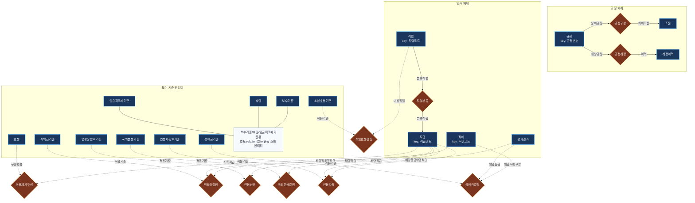

# 한국은행 보수규정 온톨로지 (Bank of Korea Compensation Regulations Ontology)

TypeDB 3.x + Neo4j 듀얼 그래프 DB 기반 Bank of Korea compensation regulations ontology project.  
보수규정 전문(20250213) PDF 문서에서 추출한 규정·호봉표·직책급표·상여금표 등 18개 범주의 데이터를 **두 가지 그래프 DB**로 모델링하고, 로컬 LLM을 활용한 자연어 질의 파이프라인을 구축합니다.

## 지식 그래프 스키마 다이어그램 (TypeDB)
한국은행 보수규정 문서의 법문과 각종 계산 표(별표)들을 TypeDB의 **N-ary (다항) 하이퍼그래프 구조**로 모델링한 스키마 설계도입니다.

👉 [전체 화면에서 TypeDB 다이어그램 크게 보기](docs/schema_diagram.md)

👉 [Neo4j 대응 다이어그램 보기](docs/neo4j_schema_diagram.md)

👉 [유사 프로젝트 초기 세팅 프롬프트 보기](docs/project_bootstrap_prompt.md)



### 현재 상태

- TypeDB 스키마의 공용 primitive 속성을 엔티티별 속성으로 정리해 허브형 attribute 안티패턴을 제거했습니다.
- TypeDB와 Neo4j 적재 데이터의 속성명을 동일한 규칙으로 맞췄습니다.
- 자연어 질의 경로에 retrieval-guided planner를 추가해 LLM 자유 생성 전에 직급, 직위, 평가등급, 국가, 초임호봉 규칙을 먼저 고정합니다.
- 실제 DB에서 live catalog를 추출하고 key binding으로 규칙 행을 선택하도록 바꿔 paraphrase 계열 질의 실패를 줄였습니다.
- 실패 케이스 재현을 위해 query trace와 E2E failure artifact를 파일로 남길 수 있습니다.
- 기준 검증 결과: `tests/validate_data.py all` 기준 TypeDB 101/101, Neo4j 101/101 통과
- 직접 질의 스모크 테스트 결과: `tests/test_nl_pipeline.py direct all` 기준 TypeDB 12/12, Neo4j 12/12 통과
- Neo4j 브라우저용 샘플 질의는 [docs/neo4j_browser_queries.md](docs/neo4j_browser_queries.md)에서 바로 사용할 수 있습니다.

---

## 프로젝트 구조

```
bok-compensation-regulations/
├── src/
│   ├── bok_compensation/             # TypeDB 구현
│   │   ├── __init__.py
│   │   ├── config.py                 # TypeDB 연결 설정 (TypeDBConfig)
│   │   ├── connection.py             # 드라이버 연결 유틸리티
│   │   ├── create_db.py              # DB 생성 및 스키마 로드
│   │   ├── insert_data.py            # PDF 기반 데이터 삽입 (18단계)
│   │   ├── check_db.py               # DB 데이터 검증
│   │   ├── graph_query_demo.py       # 그래프 탐색 쿼리 데모
│   │   ├── live_catalog.py           # TypeDB/Neo4j live binding 추출
│   │   ├── nl_query.py               # 레거시 호환 자연어 진입점
│   │   ├── langgraph_query.py        # LangGraph 기반 자연어 질의 파이프라인
│   │   ├── query_retrieval.py        # retrieval-guided intent/value grounding
│   │   ├── verify_schema.py          # 스키마 검증
│   │   ├── load_schema.py            # 스키마 로드 (레거시)
│   │   └── sample_queries.py         # 샘플 쿼리 (레거시)
│   └── bok_compensation_neo4j/       # Neo4j 구현
│       ├── __init__.py
│       ├── config.py                 # Neo4j 연결 설정 (Neo4jConfig)
│       ├── connection.py             # 드라이버 연결 유틸리티
│       ├── create_schema.py          # 제약조건/인덱스 생성 (14+3)
│       ├── insert_data.py            # 동일 데이터를 Neo4j로 적재
│       ├── check_db.py               # DB 데이터 검증
│       ├── graph_query_demo.py       # Cypher 그래프 탐색 데모
│       ├── nl_query.py               # 레거시 호환 자연어 진입점
│       └── langgraph_query.py        # LangGraph 기반 자연어 질의 파이프라인
│   └── bok_compensation_context/     # 텍스트/마크다운 컨텍스트 비교용 구현
│       ├── __init__.py
│       ├── context_query.py          # 전처리 문서 기반 직접 추론
│       ├── langgraph_query.py        # 비교용 LangGraph 래퍼
│       └── regulation_context.md     # 조문+표 전처리 문서
├── schema/
│   └── compensation_regulation.tql   # TypeQL 온톨로지 스키마 (v2)
├── docs/
│   └── 보수규정 전문(20250213).pdf     # 원문 규정 (18페이지)
├── tests/
│   ├── __init__.py
│   ├── validate_data.py              # PDF ↔ DB 데이터 검증 (101건/DB)
│   ├── test_nl_pipeline.py           # 직접 쿼리 + E2E + failure artifact 저장
│   ├── test_nl_regressions.py        # 자연어 회귀 케이스 (TypeDB/Neo4j 공통)
│   ├── test_query_rules.py           # retrieval-guided planner 회귀 테스트
│   ├── test_nl_router.py             # Neo4j 라우터 호환성 테스트
│   └── test_typedb_router.py         # TypeDB 라우터 호환성 테스트
├── pyproject.toml
└── README.md
```

---

## 사전 요구사항

| 구성 요소 | 버전 | 용도 |
|-----------|------|------|
| Python | 3.9+ | 런타임 |
| TypeDB Server | 3.x | 그래프 DB (Docker) |
| Neo4j | 5.x Community | 그래프 DB (Docker) |
| Docker / Rancher Desktop | 최신 | 컨테이너 실행 |
| Ollama | 최신 | 로컬 LLM 추론 (자연어 질의) |

---

## 설치 및 실행

### 1. 컨테이너 실행

```bash
# TypeDB
docker run -d --name typedb \
  -p 1729:1729 -p 8000:8000 \
  typedb/typedb:latest

# Neo4j
docker run -d --name neo4j \
  -p 7474:7474 -p 7687:7687 \
  -e NEO4J_AUTH=neo4j/password \
  neo4j:5-community
```

### 2. Python 환경 구축

```bash
python3 -m venv .venv
source .venv/bin/activate
pip install -e .[dev,neo4j,llm]

# 전체 선택 의존성을 한 번에 설치하지 않을 경우
pip install -e .[dev]
pip install -e .[neo4j,llm]
```

`pyproject.toml`에는 최소 의존성 외에 `neo4j`, `llm`, `full` extras를 정의했습니다. Neo4j 파이프라인과 Ollama 기반 자연어 질의를 함께 쓰려면 `.[dev,neo4j,llm]` 또는 `.[full]`로 설치하면 됩니다.

### 3-A. TypeDB: DB 생성 → 데이터 삽입

```bash
PYTHONPATH=src python -m bok_compensation.create_db
PYTHONPATH=src python -m bok_compensation.insert_data
PYTHONPATH=src python -m bok_compensation.check_db
```

### 3-B. Neo4j: 스키마 → 데이터 삽입

```bash
PYTHONPATH=src python -m bok_compensation_neo4j.create_schema
PYTHONPATH=src python -m bok_compensation_neo4j.insert_data
PYTHONPATH=src python -m bok_compensation_neo4j.check_db
```

검증은 [tests/validate_data.py](tests/validate_data.py)를 기준으로 수행합니다. 현재 기준 결과는 두 DB 모두 `101/101` 통과입니다.

### 4. 그래프 탐색 데모

```bash
# TypeDB (TypeQL)
PYTHONPATH=src python -m bok_compensation.graph_query_demo

# Neo4j (Cypher)
PYTHONPATH=src python -m bok_compensation_neo4j.graph_query_demo
```

### 5. 자연어 질의

기본값은 OpenAI 호환 엔드포인트를 사용합니다.

`.env.example`를 복사해 환경변수 파일로 써도 됩니다.

```bash
export LLM_PROVIDER=openai-compatible
export OPENAI_BASE_URL=http://211.188.81.250:30402/v1
export OPENAI_MODEL=HCX-GOV-THINK-V1-32B
```

Ollama의 Qwen 모델을 계속 쓰려면 아래처럼 provider만 바꾸면 됩니다.

```bash
brew install ollama
ollama serve                                    # 서버 시작
ollama pull qwen2.5-coder:14b-instruct          # 모델 다운로드 (~9GB)
export LLM_PROVIDER=ollama
export OLLAMA_URL=http://localhost:11434
export OLLAMA_MODEL=qwen2.5-coder:14b-instruct
```

# TypeDB LangGraph 파이프라인
PYTHONPATH=src python -m bok_compensation.langgraph_query \
  "3급 직원이 팀장 직책을 맡고 EX 평가를 받은 경우, 본봉과 직책급은?"

# TypeDB 규정 해석형 질문
PYTHONPATH=src python -m bok_compensation.langgraph_query \
  "기한부 고용계약자는 상여금을 받을 수 있어?"

# Neo4j LangGraph 파이프라인
PYTHONPATH=src python -m bok_compensation_neo4j.langgraph_query \
  "3급 직원이 팀장 직책을 맡고 EX 평가를 받은 경우, 본봉과 직책급은?"

# Neo4j 규정 해석형 질문
PYTHONPATH=src python -m bok_compensation_neo4j.langgraph_query \
  "기한부 고용계약자는 상여금을 받을 수 있어?"

# Context 문서 기반 비교용 질문
PYTHONPATH=src python -m bok_compensation_context.langgraph_query \
  "기한부 고용계약자가 상여금을 받을 수 있는지와 G5 직원의 초봉을 함께 알려줘."

# 복합질문 3-way 비교표 출력
PYTHONPATH=src python tests/test_nl_pipeline.py compare
```

현재 저장소의 기본 자연어 실행 엔트리포인트는 `langgraph_query.py`이며, `nl_query.py`는 테스트 및 기존 호출부 호환을 위한 얇은 래퍼입니다.

역할 차이:
- `langgraph_query.py`: 기본 실행 경로입니다. 복합질문을 `Planner → Semantic/Data → Summary`로 분해해 처리합니다.
- `nl_query.py`: 단일 라우터 호환 레이어입니다. 주로 기존 호출부, E2E 쿼리 생성 테스트, 라우팅 단위 테스트에서 사용합니다.
- 복합질문 검증은 `langgraph_query.py` 기준으로 보는 것이 맞고, `nl_query.py`는 혼합 의도를 완전하게 다루는 목적이 아닙니다.

추가 가드레일:
- `query_retrieval.py`가 질문에서 intent와 핵심 슬롯을 먼저 추출하고, `live_catalog.py`가 실제 DB의 직급·직위·평가등급·규칙 행을 catalog로 노출합니다.
- `query_rules.py`는 retrieval 결과를 기반으로 TypeQL/Cypher 템플릿을 우선 선택하고, 그 뒤에만 LLM 자유 생성을 사용합니다.
- `bok_compensation_context`는 같은 질문을 그래프 DB 없이 전처리 문서만으로 답하게 하는 비교용 경로입니다.
- `BOK_USE_LIVE_CATALOG`, `BOK_USE_KEY_BINDING`으로 live catalog와 key binding 사용 여부를 제어할 수 있습니다.
- `BOK_QUERY_TRACE_DIR`, `BOK_FAILURE_TRACE_DIR`를 지정하면 query trace와 실패 artifact를 JSON으로 저장합니다.

### 6. Neo4j 브라우저 시각화

```
http://localhost:7474  (ID: neo4j / PW: password)
```

샘플 Cypher 모음:
- [docs/neo4j_browser_queries.md](docs/neo4j_browser_queries.md)

스키마 시각화:
```cypher
CALL db.schema.visualization()
```

그래프 탐색 예시:
```cypher
MATCH (g:직급 {직급코드: '3급'})-[r]-(n) RETURN g, r, n LIMIT 30
```

---

## 온톨로지 스키마

보수규정 문서의 모든 정보를 표현하도록 전면 개정된 스키마입니다.

### Neo4j LPG 스키마 다이어그램


### 엔티티/노드 (17종, 409건)

| 엔티티 | 건수 | 출처 | 설명 |
|--------|------|------|------|
| 규정 | 1 | 제1조 | 보수규정 본체 |
| 조문 | 18 | 제1~18조 | 개별 조·항·호 |
| 개정이력 | 9 | 부칙 | 규정 개정 내역 |
| 직렬 | 5 | 제3조 | 종합기획/일반기능 등 |
| 직급 | 14 | 제3조 | 1급~6급, 총재, 부총재 등 |
| 직위 | 10 | 별표1-1 | 부서장(가/나), 팀장, 조사역 등 |
| 호봉 | 245 | 별표1 | 3~6급 50호봉 + GA 30 + CL·PO 25호봉 |
| 수당 | 15 | 제8조 | 출납/전산/기술/조사연구 업무수당 |
| 보수기준 | 4 | 제5~7조 | 위원/총재/부총재/감사 기본급 |
| 직책급기준 | 18 | 별표1-1 | 직위×직급별 연간 직책급액 |
| 상여금기준 | 25 | 별표1-2 | 정기상여금 + 평가상여금 지급률 |
| 연봉차등액기준 | 12 | 별표7 | 직급×평가등급별 월차등액 |
| 연봉상한액기준 | 3 | 별표8 | 1~3급 연봉 상한액 |
| 임금피크제기준 | 3 | 별표9 | 1~3년차 지급률 |
| 국외본봉기준 | 16 | 별표1-5 | 6개국 직급별 해외 본봉 |
| 초임호봉기준 | 6 | 별표2 | 직렬별 초임호봉 |
| 평가결과 | 5 | 제11조 | EX/EE/ME/BE/NI |

### 주요 관계 유형

| 관계 | TypeDB 역할 | Neo4j | 건수 |
|------|------------|-------|------|
| 규정구성 | 상위규정 ↔ 하위조문 | `(:규정)-[:규정구성]->(:조문)` | 18 |
| 규정개정 | 대상규정 ↔ 이력 | `(:규정)-[:규정개정]->(:개정이력)` | 9 |
| 직렬분류 | 분류직렬 ↔ 분류직급 | `(:직렬)-[:직렬분류]->(:직급)` | 14 |
| 호봉체계구성 | 소속직급 ↔ 구성호봉 | `(:직급)-[:호봉체계구성]->(:호봉)` | 245 |
| 직책급결정 | 적용기준 ↔ 해당직급 ↔ 해당직위 | `(:직책급기준)-[:해당직급/해당직위]->` | 18 |
| 상여금결정 | 적용기준 ↔ 해당직책구분 ↔ 해당등급 | `(:상여금기준)-[:해당직책구분/해당등급]->` | 24 |
| 연봉차등 | 적용기준 ↔ 해당직급 ↔ 해당등급 | `(:연봉차등액기준)-[:해당직급/해당등급]->` | 12 |
| 연봉상한 | 적용기준 ↔ 해당직급 | `(:연봉상한액기준)-[:해당직급]->` | 3 |
| 국외본봉결정 | 적용기준 ↔ 해당직급 | `(:국외본봉기준)-[:해당직급]->` | 16 |
| 초임호봉결정 | 적용기준 ↔ 대상직렬 | `(:초임호봉기준)-[:대상직렬]->` | 6 |

---

## 주요 기능

### 1. 그래프 탐색 쿼리 (graph_query_demo)

RDB에서는 5개 테이블을 서로 다른 복합키로 JOIN해야 하는 질문을, **단일 쿼리 패턴**으로 해결합니다.

```
 직급("3급") ──→ 호봉체계구성 ──→ 호봉(본봉)
      │
      ├── + 직위("팀장") ──→ 직책급결정 ──→ 직책급액
      │
      ├── + 평가("EX")  ──→ 연봉차등   ──→ 차등액
      │
       └────────────────→ 연봉상한   ──→ 연봉상한액

     직위("팀장") + 평가("EX") ──→ 상여금결정 ──→ 상여금지급률
```

**TypeQL 쿼리:**

```typeql
match
    $grade isa 직급, has 직급코드 "3급";
    $pos isa 직위, has 직위명 $posname;
    { $posname == "팀장"; };
    $eval isa 평가결과, has 평가등급 "EX";
    (소속직급: $grade, 구성호봉: $step) isa 호봉체계구성;
    $step has 호봉번호 $n, has 호봉금액 $salary;
    (적용기준: $ppstd, 해당직급: $grade, 해당직위: $pos) isa 직책급결정;
    $ppstd has 직책급액 $ppay;
    (적용기준: $bstd, 해당직책구분: $pos, 해당등급: $eval) isa 상여금결정;
    $bstd has 상여금지급률 $brate;
    (적용기준: $dstd, 해당직급: $grade, 해당등급: $eval) isa 연봉차등;
    $dstd has 차등액 $diff;
    (적용기준: $cstd, 해당직급: $grade) isa 연봉상한;
    $cstd has 연봉상한액 $cap;
sort $n desc;
limit 1;
```

**Cypher 쿼리 (동일 질문):**

```cypher
MATCH (grade:직급 {직급코드: '3급'})-[:호봉체계구성]->(step:호봉)
MATCH (pos:직위 {직위명: '팀장'})
MATCH (eval:평가결과 {평가등급: 'EX'})
MATCH (pp:직책급기준)-[:해당직급]->(grade), (pp)-[:해당직위]->(pos)
MATCH (b:상여금기준)-[:해당직책구분]->(pos), (b)-[:해당등급]->(eval)
MATCH (d:연봉차등액기준)-[:해당직급]->(grade), (d)-[:해당등급]->(eval)
MATCH (c:연봉상한액기준)-[:해당직급]->(grade)
RETURN step.호봉번호 AS n, step.호봉금액 AS salary,
  pp.직책급액 AS ppay, b.상여금지급률 AS brate,
  d.차등액 AS diff, c.연봉상한액 AS cap
ORDER BY n DESC LIMIT 1
```

**실행 결과 (두 DB 동일):**

```
본봉 (50호봉):      월    6,890,000원
직책급:              월      163,000원  (연 1,956,000)
기본급 합계:         월    7,053,000원  (연 84,636,000)
평가상여금 지급률:              85%
연봉제 차등액:       월   +3,024,000원  (연 36,288,000)
연봉제 상한액:       월   77,724,000원
추정 연간 총보수:         192,864,600원
```

### 2. 자연어 질의 파이프라인 (langgraph_query)

Ollama 로컬 LLM(qwen2.5-coder:14b-instruct)을 활용하여 한국어 질문을 하위 작업으로 나누고, TypeQL/Cypher 조회 결과와 조문 컨텍스트를 결합해 답변합니다.

```
💬 자연어 질문
  ↓  Planner Agent
질문을 조문 해석 / 데이터 조회로 분해
  ↓
Semantic Agent / Data Agent 병렬 실행
  ↓
Summary Agent가 최종 답변 통합
```

현재 구현은 `Planner → Semantic/Data → Summary` 구조의 LangGraph 워크플로우입니다.

- `planner_node`: 질문을 조문 해석 쿼리와 데이터 조회 쿼리로 분해
- `semantic_agent_node`: `조문` / `:조문` 데이터를 읽어 규정 해석 답변 생성
- `data_agent_node`: TypeQL 또는 Cypher를 생성해 DB에서 직접 조회
- `summary_agent_node`: 두 결과를 합쳐 최종 자연어 답변 작성

현재 코드 기준 특징:

- TypeDB와 Neo4j 모두 조문 기반 질의와 수치 질의를 하나의 진입점에서 처리
- TypeDB 파이프라인은 `schema/compensation_regulation.tql` 일부를 프롬프트에 포함해 TypeQL 생성을 유도
- Neo4j 파이프라인은 그래프 스키마 요약을 프롬프트에 포함해 Cypher 생성을 유도
- 두 구현 모두 조회 결과를 JSON 문자열로 정리한 뒤 최종 답변 생성을 수행
- 반복적으로 등장하는 질문 패턴은 `query_rules.py`의 규칙 기반 템플릿으로 우선 보정해, 모델 편차가 있어도 핵심 질의를 안정적으로 처리합니다.

예시 질문:

| 질문 | TypeDB | Neo4j |
|------|--------|-------|
| 미국과 일본에 주재하는 1급 직원의 국외본봉을 비교해줘 | ✅ | ✅ |
| 3급과 4급의 25호봉 본봉 차이는 얼마야? | ✅ | ✅ |
| 보수규정의 개정이력을 보여줘 | ✅ | ✅ |
| 종합기획직렬의 초임호봉은 몇 호봉이야? | ✅ | ✅ |
| G5 직급의 초봉은? | ✅ | ✅ |
| 일반사무직원의 초봉은? | 실행 가능 | 실행 가능 |
| 기한부 고용계약자는 상여금을 받을 수 있어? | 실행 가능 | 실행 가능 |

### 3. 테스트 인프라

#### 데이터 검증 (validate_data.py)

PDF 원문과 DB 데이터가 일치하는지 11개 범주, DB당 101건을 자동 검증합니다.

```bash
# 전체 검증 (양 DB)
PYTHONPATH=src python tests/validate_data.py all

# 개별 DB
PYTHONPATH=src python tests/validate_data.py neo4j
PYTHONPATH=src python tests/validate_data.py typedb
```

검증 범주: 노드/엔티티 수(17), 본봉표(21), 호봉 수(7), 직책급(18), 연봉차등(12), 연봉상한(3), 임금피크제(3), 초임호봉(6), 상여금(6), 국외본봉(4), 보수기준(4)

#### NL 파이프라인 테스트 (test_nl_pipeline.py)

DB 직접 쿼리, E2E 쿼리 생성, LangGraph 스모크, 복합질문 비교를 하나의 스크립트에서 실행할 수 있습니다. E2E 실패 시 질문, 계획, 결과 행, 오류를 artifact로 저장할 수 있습니다.

```bash
# 직접 쿼리 스모크 테스트
PYTHONPATH=src python tests/test_nl_pipeline.py direct all

# DB별 직접 쿼리 테스트
PYTHONPATH=src python tests/test_nl_pipeline.py direct neo4j
PYTHONPATH=src python tests/test_nl_pipeline.py direct typedb

# provider 설정 후 E2E 시나리오
PYTHONPATH=src python tests/test_nl_pipeline.py e2e typedb
PYTHONPATH=src python tests/test_nl_pipeline.py e2e neo4j

# LangGraph 스모크 테스트
PYTHONPATH=src python tests/test_nl_pipeline.py langgraph typedb
PYTHONPATH=src python tests/test_nl_pipeline.py langgraph neo4j
PYTHONPATH=src python tests/test_nl_pipeline.py langgraph context

# 복합질문 비교표
PYTHONPATH=src python tests/test_nl_pipeline.py compare

# 전체 묶음 실행
PYTHONPATH=src python tests/test_nl_pipeline.py all all

# 데이터 검증
PYTHONPATH=src python tests/validate_data.py all

# retrieval planner 회귀
PYTHONPATH=src python -m pytest tests/test_query_rules.py -q

# 자연어 회귀 케이스
PYTHONPATH=src python -m pytest tests/test_nl_regressions.py -q
```

최근 확인한 결과:

- `PYTHONPATH=src python tests/validate_data.py all` → TypeDB 101/101, Neo4j 101/101 통과
- `PYTHONPATH=src python tests/test_nl_pipeline.py direct all` → TypeDB 12/12, Neo4j 12/12 통과
- `PYTHONPATH=src python tests/test_nl_pipeline.py e2e typedb` → TypeDB 6/6 통과
- `PYTHONPATH=src python tests/test_nl_pipeline.py e2e neo4j` → Neo4j 6/6 통과
- `PYTHONPATH=src python tests/test_nl_pipeline.py langgraph typedb` → TypeDB 2/2 통과
- `PYTHONPATH=src python tests/test_nl_pipeline.py langgraph neo4j` → Neo4j 2/2 통과
- `PYTHONPATH=src python tests/test_nl_pipeline.py langgraph context` → Context 2/2 통과
- `PYTHONPATH=src python tests/test_nl_pipeline.py compare` → 복합질문 4건 비교표 출력, TypeDB/Neo4j/Context 전부 PASS
- `PYTHONPATH=src python -m pytest tests/test_query_rules.py -q` → 8건 통과
- `PYTHONPATH=src python -m pytest tests/test_query_rules.py tests/test_nl_regressions.py -q` → 22건 통과

참고:

- [tests/test_nl_router.py](tests/test_nl_router.py), [tests/test_typedb_router.py](tests/test_typedb_router.py)는 `nl_query.py` 호환 레이어를 기준으로 라우팅 분기를 검증합니다.
- [tests/test_query_rules.py](tests/test_query_rules.py)는 retrieval-guided planner와 규칙 기반 보정 로직을 검증합니다.
- [tests/test_nl_regressions.py](tests/test_nl_regressions.py)는 paraphrase와 보수 패키지 질의를 두 백엔드에 공통으로 재생합니다.

직접 쿼리 테스트 항목: 5급 11호봉, 3급 50호봉, 팀장 3급 직책급, G5 초봉(JOIN), 1급 EX 차등액, 미국 1급 국외본봉, 부서장가 EX 상여금, 임금피크제 2년차, 3급 호봉수, 개정이력 건수, 총재 보수기준, 5급 호봉 범위

복합질문 비교 항목: 기한부+미국1급 국외본봉, G5 초봉+미국2급 국외본봉, 기한부+G5 초봉, 개정이력+임금피크제 2년차 지급률

---

## TypeDB vs Neo4j 비교

| 항목 | TypeDB 3.x | Neo4j 5.x |
|------|-----------|-----------|
| **데이터 모델** | Entity-Relation-Attribute (타입 이론) | Labeled Property Graph |
| **스키마** | 필수, 엄격한 타입+상속 (398줄 TQL) | 선택적 (제약조건 14개 + 인덱스 3개) |
| **쿼리 언어** | TypeQL | Cypher |
| **N-ary 관계** | 네이티브 지원 (3자 이상 역할) | 중간 노드 또는 복수 관계로 모델링 |
| **산술 연산** | match 절 안에서 계산식 표현 가능 | RETURN/WITH 절에서 자유롭게 계산 |
| **집계 함수** | 미지원 (3.x) | count/sum/avg/min/max |
| **LLM 호환성** | TypeQL 학습 데이터 적음 | Cypher 학습 데이터 풍부 |
| **시각화** | 제한적 | Neo4j Browser 내장 (http://localhost:7474) |
| **타입 안전성** | 매우 엄격 (컴파일 타임 검증) | 유연 (런타임 자유) |

### 현재 작업 결과 기준 추천

현재 저장소의 구현·테스트·실행 결과를 기준으로 하면, **실용적인 자연어 질의 엔진으로는 Neo4j가 더 유리**합니다.

- **Neo4j 권장 이유**
  - Cypher가 LLM이 생성하기 쉬운 편이고 WITH/RETURN 중심 계산 흐름이 단순해 정량 질의 운영에 유리함
  - LLM이 Cypher를 더 안정적으로 생성하는 경향이 있음
  - 브라우저 기반 시각화와 디버깅이 편함

- **TypeDB 강점**
  - 스키마와 타입 제약이 엄격해 데이터 정합성 관리에 강함
  - 관계 의미를 더 엄밀하게 표현할 수 있어 온톨로지 모델로 적합함
  - 규정/정책 지식 구조화 관점에서는 장점이 큼

권장 운영 방향:

- **주 질의 엔진**: Neo4j
- **정합성 검증/참조 온톨로지**: TypeDB

즉, 현재 단계에서는 **Neo4j를 사용자 질의 응답의 메인 엔진으로 사용하고, TypeDB를 정합성 중심의 백업/검증 모델로 병행하는 구성이 가장 적절**합니다.

---

## RDB 대비 그래프 DB의 장점

| 항목 | RDB | 그래프 DB (TypeDB / Neo4j) |
|------|-----|---------------------------|
| 5개 테이블 조회 | 5-way JOIN (복합키 매번 다름) | 단일 패턴 매칭 |
| 스키마 변경 | JOIN 조건 전부 수정 | 관계 추가만으로 확장 |
| 의미적 표현 | 외래키(FK)로 간접 표현 | 관계(Relation)가 1등 시민 |
| 다차원 복합키 | 직급+직위, 직급+평가등급 등 별도 처리 | 역할/관계로 자연스럽게 표현 |

---

## 데이터 출처 매핑

| 데이터 | 문서 출처 |
|--------|----------|
| 규정·조문 | 제1조~제18조 본문 |
| 개정이력 | 부칙 (9차 개정 내역) |
| 직렬·직급 분류 | 제3조 (직원의 구분) |
| 직위 | 별표1-1 직책급표 행 헤더 |
| 3~6급 호봉표 | 별표1의 1·2 본봉표 |
| 일반사무직원 호봉표 | 별표1의 3 |
| 서무직원·청원경찰 호봉표 | 별표1의 4 |
| 직책급표 | 별표1-1 |
| 평가상여금 지급률 | 별표1-2 |
| 연봉차등액 | 별표7 |
| 연봉상한액 | 별표8 |
| 임금피크제 지급률 | 별표9 |
| 국외본봉 | 별표1-5 |
| 초임호봉 | 별표2 |
| 수당 | 제8조 (수당의 지급) |
| 보수기준 (위원·집행간부) | 제5~7조 |

---

## 환경 변수

| 변수 | 기본값 | 설명 |
|------|--------|------|
| `TYPEDB_ADDRESS` | `localhost:1729` | TypeDB 서버 주소 |
| `TYPEDB_DATABASE` | `bok-compensation-regulations` | TypeDB 데이터베이스명 |
| `TYPEDB_USERNAME` | `admin` | TypeDB 사용자명 |
| `TYPEDB_PASSWORD` | `password` | TypeDB 비밀번호 |
| `NEO4J_URI` | `bolt://localhost:7687` | Neo4j Bolt 주소 |
| `NEO4J_USERNAME` | `neo4j` | Neo4j 사용자명 |
| `NEO4J_PASSWORD` | `password` | Neo4j 비밀번호 |
| `NEO4J_DATABASE` | `neo4j` | Neo4j 데이터베이스명 |
| `LLM_PROVIDER` | `openai-compatible` | `openai-compatible` 또는 `ollama` |
| `OPENAI_BASE_URL` | `http://211.188.81.250:30402/v1` | OpenAI 호환 API 주소 |
| `OPENAI_MODEL` | `HCX-GOV-THINK-V1-32B` | OpenAI 호환 엔드포인트에서 사용할 모델 |
| `OPENAI_API_KEY` | `unused` | 필요 시 API 키, 기본 엔드포인트는 더미값으로 동작 |
| `OLLAMA_URL` | `http://localhost:11434` | Ollama 서버 주소 |
| `OLLAMA_MODEL` | `qwen2.5-coder:14b-instruct` | Ollama 사용 시 자연어 질의에 사용할 LLM |

---

## 기술 스택

- **TypeDB 3.x** — 그래프 데이터베이스 (Docker: `typedb/typedb:latest`)
- **Neo4j 5.x Community** — 그래프 데이터베이스 (Docker: `neo4j:5-community`)
- **typedb-driver** — TypeDB Python 드라이버
- **neo4j (Python)** — Neo4j Bolt 드라이버 (현재 `pyproject.toml`에는 미포함, 별도 설치 필요)
- **langchain-ollama / langchain-openai / langchain-core / langgraph** — LangGraph 기반 자연어 질의 실행용
- **OpenAI 호환 엔드포인트 또는 Ollama + Qwen2.5-Coder 14B** — 자연어 → TypeQL/Cypher 변환
- **Python 3.9+** — 런타임

## 현재 검증 기준과 한계

- 저장소의 현재 기준선은 `validate_data.py`, `test_nl_pipeline.py direct`, `test_nl_pipeline.py e2e`, `test_nl_pipeline.py langgraph`, `test_nl_pipeline.py compare` 입니다.
- 현재 기본 LLM 경로는 OpenAI 호환 엔드포인트(`OPENAI_BASE_URL`)이며, Ollama Qwen은 선택 옵션으로 유지됩니다.
- 단일 질의 생성과 핵심 조회 검증은 `direct`와 `e2e`에서 확인하고, 복합질문 품질은 `langgraph`와 `compare`에서 확인합니다.
- `tests/test_nl_router.py`, `tests/test_typedb_router.py`는 호환용 `nl_query.py` 레이어를 검증하고, `tests/test_query_rules.py`, `tests/test_nl_regressions.py`는 retrieval-guided planner와 paraphrase 회귀를 검증합니다.
- 현재 복합질문 안정성은 규칙 기반 템플릿과 Planner 후처리에 일부 의존합니다. 실서비스 수준으로 더 확장하려면 few-shot 예시 보강, 질의 유형 세분화, 실패한 쿼리에 대한 재작성 루프가 추가로 필요합니다.
