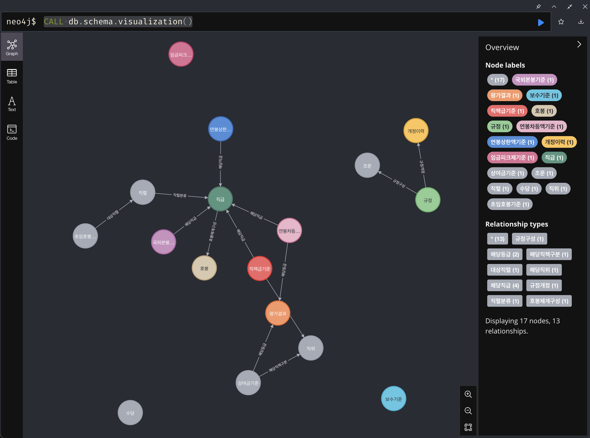

# 한국은행 보수규정 온톨로지 (BOK Compensation Regulations)

TypeDB 3.x + Neo4j 듀얼 그래프 DB 기반 한국은행 인사 보수규정 온톨로지 프로젝트.  
보수규정 전문(20250213) PDF 문서에서 추출한 규정·호봉표·직책급표·상여금표 등 18개 범주의 데이터를 **두 가지 그래프 DB**로 모델링하고, 로컬 LLM을 활용한 자연어 질의 파이프라인을 구축합니다.

---

## 프로젝트 구조

```
bok-compensation-regulations/
├── src/
│   ├── bok_compensation/             # TypeDB 구현
│   │   ├── __init__.py
│   │   ├── config.py                 # TypeDB 연결 설정 (TypeDBConfig)
│   │   ├── connection.py             # 드라이버 연결 유틸리티
│   │   ├── create_db.py              # DB 생성 및 스키마 로드
│   │   ├── insert_data.py            # PDF 기반 데이터 삽입 (18단계)
│   │   ├── check_db.py               # DB 데이터 검증
│   │   ├── graph_query_demo.py       # 그래프 탐색 쿼리 데모
│   │   ├── nl_query.py               # 자연어 → TypeQL → 답변 파이프라인
│   │   ├── verify_schema.py          # 스키마 검증
│   │   ├── load_schema.py            # 스키마 로드 (레거시)
│   │   └── sample_queries.py         # 샘플 쿼리 (레거시)
│   └── bok_compensation_neo4j/       # Neo4j 구현
│       ├── __init__.py
│       ├── config.py                 # Neo4j 연결 설정 (Neo4jConfig)
│       ├── connection.py             # 드라이버 연결 유틸리티
│       ├── create_schema.py          # 제약조건/인덱스 생성 (14+3)
│       ├── insert_data.py            # 동일 데이터를 Neo4j로 적재
│       ├── check_db.py               # DB 데이터 검증
│       ├── graph_query_demo.py       # Cypher 그래프 탐색 데모
│       └── nl_query.py               # 자연어 → Cypher → 답변 파이프라인
├── schema/
│   └── compensation_regulation.tql   # TypeQL 온톨로지 스키마 (v2)
├── docs/
│   └── 보수규정 전문(20250213).pdf     # 원문 규정 (18페이지)
├── tests/
│   ├── __init__.py
│   ├── validate_data.py              # PDF ↔ DB 데이터 검증 (101건/DB)
│   └── test_nl_pipeline.py           # NL 직접 쿼리(12) + E2E LLM(6) 테스트
├── pyproject.toml
└── README.md
```

---

## 사전 요구사항

| 구성 요소 | 버전 | 용도 |
|-----------|------|------|
| Python | 3.9+ | 런타임 |
| TypeDB Server | 3.x | 그래프 DB (Docker) |
| Neo4j | 5.x Community | 그래프 DB (Docker) |
| Docker / Rancher Desktop | 최신 | 컨테이너 실행 |
| Ollama | 최신 | 로컬 LLM 추론 (자연어 질의) |

---

## 설치 및 실행

### 1. 컨테이너 실행

```bash
# TypeDB
docker run -d --name typedb \
  -p 1729:1729 -p 8000:8000 \
  typedb/typedb:latest

# Neo4j
docker run -d --name neo4j \
  -p 7474:7474 -p 7687:7687 \
  -e NEO4J_AUTH=neo4j/password \
  neo4j:5-community
```

### 2. Python 환경 구축

```bash
python3 -m venv .venv
source .venv/bin/activate
pip install -e .
```

### 3-A. TypeDB: DB 생성 → 데이터 삽입

```bash
PYTHONPATH=src python -m bok_compensation.create_db
PYTHONPATH=src python -m bok_compensation.insert_data
PYTHONPATH=src python -m bok_compensation.check_db
```

### 3-B. Neo4j: 스키마 → 데이터 삽입

```bash
PYTHONPATH=src python -m bok_compensation_neo4j.create_schema
PYTHONPATH=src python -m bok_compensation_neo4j.insert_data
PYTHONPATH=src python -m bok_compensation_neo4j.check_db
```

검증 출력 (두 DB 모두 동일한 데이터):
```
총 노드/엔티티: 407건
총 관계: 363건 (TypeDB) / 417건 (Neo4j)
```
> Neo4j에서 관계 수가 더 많은 이유: TypeDB의 N-ary 관계(3자 이상)가 Neo4j에서는 복수 관계로 분해되기 때문

### 4. 그래프 탐색 데모

```bash
# TypeDB (TypeQL)
PYTHONPATH=src python -m bok_compensation.graph_query_demo

# Neo4j (Cypher)
PYTHONPATH=src python -m bok_compensation_neo4j.graph_query_demo
```

### 5. 자연어 질의 (Ollama 필요)

```bash
brew install ollama
ollama serve                                    # 서버 시작
ollama pull qwen2.5-coder:14b-instruct          # 모델 다운로드 (~9GB)

# TypeDB 파이프라인
PYTHONPATH=src python -m bok_compensation.nl_query \
  "3급 직원이 팀장 직책을 맡고 EX 평가를 받은 경우, 본봉과 직책급은?"

# Neo4j 파이프라인
PYTHONPATH=src python -m bok_compensation_neo4j.nl_query \
  "3급 직원이 팀장 직책을 맡고 EX 평가를 받은 경우, 본봉과 직책급은?"
```

### 6. Neo4j 브라우저 시각화

```
http://localhost:7474  (ID: neo4j / PW: password)
```

스키마 시각화:
```cypher
CALL db.schema.visualization()
```

그래프 탐색 예시:
```cypher
MATCH (g:직급 {직급코드: '3급'})-[r]-(n) RETURN g, r, n LIMIT 30
```

---

## 온톨로지 스키마

보수규정 문서의 모든 정보를 표현하도록 전면 개정된 스키마입니다.

### Neo4j LPG 스키마 다이어그램



### 엔티티/노드 (17종, 407건)

| 엔티티 | 건수 | 출처 | 설명 |
|--------|------|------|------|
| 규정 | 1 | 제1조 | 보수규정 본체 |
| 조문 | 18 | 제1~18조 | 개별 조·항·호 |
| 개정이력 | 9 | 부칙 | 규정 개정 내역 |
| 직렬 | 5 | 제3조 | 종합기획/일반기능 등 |
| 직급 | 14 | 제3조 | 1급~6급, 총재, 부총재 등 |
| 직위 | 10 | 별표1-1 | 부서장(가/나), 팀장, 조사역 등 |
| 호봉 | 245 | 별표1 | 3~6급 50호봉 + GA 30 + CL·PO 25호봉 |
| 수당 | 15 | 제8조 | 출납/전산/기술/조사연구 업무수당 |
| 보수기준 | 4 | 제5~7조 | 위원/총재/부총재/감사 기본급 |
| 직책급기준 | 18 | 별표1-1 | 직위×직급별 연간 직책급액 |
| 상여금기준 | 25 | 별표1-2 | 정기상여금 + 평가상여금 지급률 |
| 연봉차등액기준 | 12 | 별표7 | 직급×평가등급별 월차등액 |
| 연봉상한액기준 | 3 | 별표8 | 1~3급 연봉 상한액 |
| 임금피크제기준 | 3 | 별표9 | 1~3년차 지급률 |
| 국외본봉기준 | 16 | 별표1-5 | 6개국 직급별 해외 본봉 |
| 초임호봉기준 | 6 | 별표2 | 직렬별 초임호봉 |
| 평가결과 | 5 | 제11조 | EX/EE/ME/BE/NI |

### 관계 (TypeDB 19종 / Neo4j 9종)

| 관계 | TypeDB 역할 | Neo4j | 건수 |
|------|------------|-------|------|
| 규정구성 | 상위규정 ↔ 하위조문 | `(:규정)-[:규정구성]->(:조문)` | 18 |
| 규정개정 | 대상규정 ↔ 이력 | `(:규정)-[:규정개정]->(:개정이력)` | 9 |
| 직렬분류 | 분류직렬 ↔ 분류직급 | `(:직렬)-[:직렬분류]->(:직급)` | 14 |
| 호봉체계구성 | 소속직급 ↔ 구성호봉 | `(:직급)-[:호봉체계구성]->(:호봉)` | 245 |
| 직책급결정 | 적용기준 ↔ 해당직급 ↔ 해당직위 | `(:직책급기준)-[:해당직급/해당직위]->` | 18 |
| 상여금결정 | 적용기준 ↔ 해당직책구분 ↔ 해당등급 | `(:상여금기준)-[:해당직책구분/해당등급]->` | 24 |
| 연봉차등 | 적용기준 ↔ 해당직급 ↔ 해당등급 | `(:연봉차등액기준)-[:해당직급/해당등급]->` | 12 |
| 연봉상한 | 적용기준 ↔ 해당직급 | `(:연봉상한액기준)-[:해당직급]->` | 3 |
| 국외본봉결정 | 적용기준 ↔ 해당직급 | `(:국외본봉기준)-[:해당직급]->` | 16 |
| 초임호봉결정 | 적용기준 ↔ 대상직렬 | `(:초임호봉기준)-[:대상직렬]->` | 6 |

---

## 주요 기능

### 1. 그래프 탐색 쿼리 (graph_query_demo)

RDB에서는 5개 테이블을 서로 다른 복합키로 JOIN해야 하는 질문을, **단일 쿼리 패턴**으로 해결합니다.

```
 직급("3급") ──→ 호봉체계구성 ──→ 호봉(본봉)
      │
      ├── + 직위("팀장") ──→ 직책급결정 ──→ 직책급액
      │
      ├── + 평가("EX")  ──→ 연봉차등   ──→ 차등액
      │
      └────────────────→ 연봉상한   ──→ 상한액

 직위("팀장") + 평가("EX") ──→ 상여금결정 ──→ 지급률
```

**TypeQL 쿼리:**

```typeql
match
    $grade isa 직급, has 직급코드 "3급";
    $pos isa 직위, has 직위명 $posname;
    { $posname == "팀장"; };
    $eval isa 평가결과, has 평가등급 "EX";
    (소속직급: $grade, 구성호봉: $step) isa 호봉체계구성;
    $step has 호봉번호 $n, has 호봉금액 $salary;
    (적용기준: $ppstd, 해당직급: $grade, 해당직위: $pos) isa 직책급결정;
    $ppstd has 직책급액 $ppay;
    (적용기준: $bstd, 해당직책구분: $pos, 해당등급: $eval) isa 상여금결정;
    $bstd has 지급률 $brate;
    (적용기준: $dstd, 해당직급: $grade, 해당등급: $eval) isa 연봉차등;
    $dstd has 차등액 $diff;
    (적용기준: $cstd, 해당직급: $grade) isa 연봉상한;
    $cstd has 상한액 $cap;
sort $n desc;
limit 1;
```

**Cypher 쿼리 (동일 질문):**

```cypher
MATCH (grade:직급 {직급코드: '3급'})-[:호봉체계구성]->(step:호봉)
MATCH (pos:직위 {직위명: '팀장'})
MATCH (eval:평가결과 {평가등급: 'EX'})
MATCH (pp:직책급기준)-[:해당직급]->(grade), (pp)-[:해당직위]->(pos)
MATCH (b:상여금기준)-[:해당직책구분]->(pos), (b)-[:해당등급]->(eval)
MATCH (d:연봉차등액기준)-[:해당직급]->(grade), (d)-[:해당등급]->(eval)
MATCH (c:연봉상한액기준)-[:해당직급]->(grade)
RETURN step.호봉번호 AS n, step.호봉금액 AS salary,
       pp.직책급액 AS ppay, b.지급률 AS brate,
       d.차등액 AS diff, c.상한액 AS cap
ORDER BY n DESC LIMIT 1
```

**실행 결과 (두 DB 동일):**

```
본봉 (50호봉):      월    6,890,000원
직책급:              월      163,000원  (연 1,956,000)
기본급 합계:         월    7,053,000원  (연 84,636,000)
평가상여금 지급률:              85%
연봉제 차등액:       월   +3,024,000원  (연 36,288,000)
연봉제 상한액:       월   77,724,000원
추정 연간 총보수:         192,864,600원
```

### 2. 자연어 질의 파이프라인 (nl_query)

Ollama 로컬 LLM(qwen2.5-coder:14b-instruct)을 활용하여 한국어 질문을 자동으로 TypeQL/Cypher로 변환하고, 결과를 자연어로 요약합니다.

```
💬 자연어 질문
    ↓  Ollama (스키마 + few-shot 프롬프트)
📌 TypeQL / Cypher 쿼리 자동 생성
    ↓  TypeDB / Neo4j 실행
📊 DB 조회 결과
    ↓  Ollama 답변 생성
💡 자연어 답변
```

**NL 파이프라인 특징:**

- 스키마 + 9개 few-shot 예시 기반 쿼리 생성
- DB 실제 데이터 값 힌트 (직급코드, 직위명, 직렬명 등)
- 산술 연산 제한 규칙 (TypeDB) / 허용 (Neo4j Cypher RETURN 절)
- 쿼리 실패 시 오류를 LLM에 피드백하여 최대 2회 자동 재시도
- datetime 타입 자동 포맷팅
- **초임호봉 자동 보강 가드** (`_enrich_starting_step`): LLM이 초임호봉번호만 조회하고 금액을 누락한 경우 자동으로 호봉 테이블에서 금액을 보강하여 LLM 할루시네이션 방지

**테스트 통과 질문:**

| 질문 | TypeDB | Neo4j |
|------|--------|-------|
| 미국과 일본에 주재하는 1급 직원의 국외본봉을 비교해줘 | ✅ | ✅ |
| 3급과 4급의 25호봉 본봉 차이는 얼마야? | ✅ | ✅ (Cypher 내 산술) |
| 보수규정의 개정이력을 보여줘 | ✅ | ✅ |
| 종합기획직렬의 초임호봉은 몇 호봉이야? | ✅ | ✅ |
| G5 직급의 초봉은? | ✅ | ✅ |
| 일반사무직원의 초봉은? | ✅ | ✅ |

### 3. 테스트 인프라

#### 데이터 검증 (validate_data.py)

PDF 원문과 DB 데이터가 일치하는지 11개 범주, DB당 101건을 자동 검증합니다.

```bash
# 전체 검증 (양 DB)
PYTHONPATH=src python tests/validate_data.py all

# 개별 DB
PYTHONPATH=src python tests/validate_data.py neo4j
PYTHONPATH=src python tests/validate_data.py typedb
```

검증 범주: 노드/엔티티 수(17), 본봉표(21), 호봉 수(7), 직책급(18), 연봉차등(12), 연봉상한(3), 임금피크제(3), 초임호봉(6), 상여금(6), 국외본봉(4), 보수기준(4)

#### NL 파이프라인 테스트 (test_nl_pipeline.py)

DB 직접 쿼리 12종 + Ollama LLM E2E 6종을 DB별로 검증합니다.

```bash
# 전체 테스트
PYTHONPATH=src python tests/test_nl_pipeline.py all all

# 직접 쿼리만 / E2E만
PYTHONPATH=src python tests/test_nl_pipeline.py direct neo4j
PYTHONPATH=src python tests/test_nl_pipeline.py e2e typedb
```

직접 쿼리 테스트: 5급 11호봉, 3급 50호봉, 팀장 3급 직책급, G5 초봉(JOIN), 1급 EX 차등액, 미국 1급 국외본봉, 부서장가 EX 상여금, 임금피크제 2년차, 3급 호봉수, 개정이력 건수, 총재 보수기준, 5급 호봉 범위

---

## TypeDB vs Neo4j 비교

| 항목 | TypeDB 3.x | Neo4j 5.x |
|------|-----------|-----------|
| **데이터 모델** | Entity-Relation-Attribute (타입 이론) | Labeled Property Graph |
| **스키마** | 필수, 엄격한 타입+상속 (398줄 TQL) | 선택적 (제약조건 14개 + 인덱스 3개) |
| **쿼리 언어** | TypeQL | Cypher |
| **N-ary 관계** | 네이티브 지원 (3자 이상 역할) | 중간 노드 또는 복수 관계로 모델링 |
| **산술 연산** | match 절 내 불가 | RETURN 절에서 자유롭게 계산 |
| **집계 함수** | 미지원 (3.x) | count/sum/avg/min/max |
| **LLM 호환성** | TypeQL 학습 데이터 적음 | Cypher 학습 데이터 풍부 |
| **시각화** | 제한적 | Neo4j Browser 내장 (http://localhost:7474) |
| **타입 안전성** | 매우 엄격 (컴파일 타임 검증) | 유연 (런타임 자유) |

---

## RDB 대비 그래프 DB의 장점

| 항목 | RDB | 그래프 DB (TypeDB / Neo4j) |
|------|-----|---------------------------|
| 5개 테이블 조회 | 5-way JOIN (복합키 매번 다름) | 단일 패턴 매칭 |
| 스키마 변경 | JOIN 조건 전부 수정 | 관계 추가만으로 확장 |
| 의미적 표현 | 외래키(FK)로 간접 표현 | 관계(Relation)가 1등 시민 |
| 다차원 복합키 | 직급+직위, 직급+평가등급 등 별도 처리 | 역할/관계로 자연스럽게 표현 |

---

## 데이터 출처 매핑

| 데이터 | 문서 출처 |
|--------|----------|
| 규정·조문 | 제1조~제18조 본문 |
| 개정이력 | 부칙 (9차 개정 내역) |
| 직렬·직급 분류 | 제3조 (직원의 구분) |
| 직위 | 별표1-1 직책급표 행 헤더 |
| 3~6급 호봉표 | 별표1의 1·2 본봉표 |
| 일반사무직원 호봉표 | 별표1의 3 |
| 서무직원·청원경찰 호봉표 | 별표1의 4 |
| 직책급표 | 별표1-1 |
| 평가상여금 지급률 | 별표1-2 |
| 연봉차등액 | 별표7 |
| 연봉상한액 | 별표8 |
| 임금피크제 지급률 | 별표9 |
| 국외본봉 | 별표1-5 |
| 초임호봉 | 별표2 |
| 수당 | 제8조 (수당의 지급) |
| 보수기준 (위원·집행간부) | 제5~7조 |

---

## 환경 변수

| 변수 | 기본값 | 설명 |
|------|--------|------|
| `TYPEDB_ADDRESS` | `localhost:1729` | TypeDB 서버 주소 |
| `TYPEDB_DATABASE` | `bok-compensation-regulations` | TypeDB 데이터베이스명 |
| `TYPEDB_USERNAME` | `admin` | TypeDB 사용자명 |
| `TYPEDB_PASSWORD` | `password` | TypeDB 비밀번호 |
| `NEO4J_URI` | `bolt://localhost:7687` | Neo4j Bolt 주소 |
| `NEO4J_USERNAME` | `neo4j` | Neo4j 사용자명 |
| `NEO4J_PASSWORD` | `password` | Neo4j 비밀번호 |
| `NEO4J_DATABASE` | `neo4j` | Neo4j 데이터베이스명 |
| `OLLAMA_URL` | `http://localhost:11434` | Ollama 서버 주소 |
| `OLLAMA_MODEL` | `qwen2.5-coder:14b-instruct` | 자연어 질의에 사용할 LLM |

---

## 기술 스택

- **TypeDB 3.x** — 그래프 데이터베이스 (Docker: `typedb/typedb:latest`)
- **Neo4j 5.x Community** — 그래프 데이터베이스 (Docker: `neo4j:5-community`)
- **typedb-driver** — TypeDB Python 드라이버
- **neo4j (Python)** — Neo4j Bolt 드라이버
- **Ollama + Qwen2.5-Coder 14B** — 로컬 LLM (자연어 → TypeQL/Cypher 변환)
- **PyMuPDF** — PDF 텍스트 추출 (데이터 전처리 시 사용)
- **Python 3.9+** — 런타임