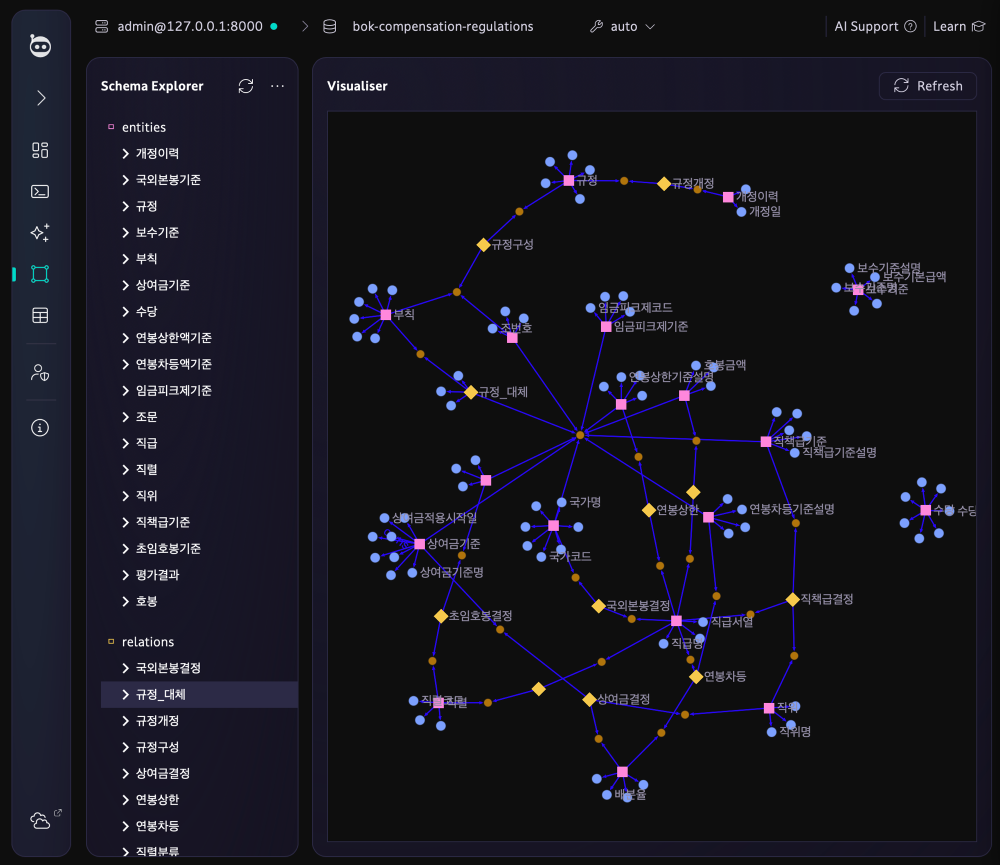
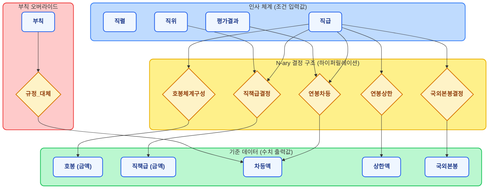

# 한국은행 보수규정 하이브리드 AI 에이전트

한국은행 보수규정 PDF를 기반으로, 지식 그래프 + Context RAG + ReAct 에이전트를 결합한 질의응답 시스템.
순수 RAG로는 불가능한 **수치 계산, 다단계 추론, 규정 간 우선순위 판단**을 해결한다.

---

## 빠른 시작 (Quick Start)

### 1. 사전 준비

| 항목 | 비고 |
|------|------|
| Docker Desktop | TypeDB, Neo4j 컨테이너 구동용. 없으면 Context RAG만 테스트 가능 |
| Python 3.9+ | 없으면 `setup.sh`가 Homebrew로 자동 설치 시도 |

### 2-A. 전체 설치 (Graph DB 포함, 권장)

```bash
chmod +x setup.sh && ./setup.sh
```

이 스크립트가 자동으로 수행하는 작업:
1. Docker / Python 사전 환경 점검
2. `.env.example` → `.env`, `llm_template.py` → `llm.py` 복사 (이미 있으면 건너뜀)
3. Docker로 TypeDB(포트 1729) + Neo4j(포트 7474/7687) 컨테이너 기동
4. Python 가상환경(`.venv`) 생성 및 전체 의존성 설치
5. TypeDB/Neo4j에 보수규정 스키마 생성 및 데이터 적재

### 2-B. Context RAG만 테스트 (Docker 불필요)

Graph DB 없이 Context RAG 모드만 테스트하려면:

```bash
python3 -m venv .venv
source .venv/bin/activate
pip install -e ".[llm,demo]"
cp .env.example .env
cp src/bok_compensation_typedb/llm_template.py src/bok_compensation_typedb/llm.py
```

### 3. LLM 엔드포인트 설정

`setup.sh`가 만들어 준 `.env` 파일을 열어 **LLM 엔드포인트만** 수정하면 된다.

```env
# 메인 추론 모델 (HCX 역할)
OPENAI_BASE_URL=https://your-llm-endpoint/v1
OPENAI_MODEL=your-model-name
OPENAI_API_KEY=your-api-key

# DB 쿼리 전문 모델 (Qwen 역할, 미설정 시 메인 모델 사용)
QWEN_BASE_URL=https://your-qwen-endpoint/v1
QWEN_MODEL=your-qwen-model-name
QWEN_API_KEY=your-qwen-api-key
```

> OpenAI-compatible API(`/v1/chat/completions`)를 지원하는 엔드포인트면 어떤 모델이든 연결 가능.
> vLLM, Ollama, LiteLLM, Azure OpenAI 등 모두 호환된다.

### 4. 웹 UI 실행

```bash
source .venv/bin/activate
streamlit run app.py --server.port 8088
```

브라우저에서 `http://localhost:8088` 접속. 사이드바에서 테스트할 아키텍처를 선택하고 질문을 입력하면 된다.

### 트러블슈팅

| 증상 | 원인 / 해결 |
|------|-------------|
| `pip install -e ...` 가 build-backend 오류로 실패 | `pyproject.toml`이 구버전이면 `git pull`로 최신화 (`build-backend = "setuptools.build_meta"`) |
| `ModuleNotFoundError: No module named 'dotenv'` | `python-dotenv` 누락 — `pip install -e ".[full]"` 재실행 |
| `ModuleNotFoundError: No module named 'src.bok_compensation_typedb.llm'` | `llm.py` 미생성 — `cp src/bok_compensation_typedb/llm_template.py src/bok_compensation_typedb/llm.py` |
| `attempted relative import with no known parent package` | `python src/.../create_db.py` 직접 실행 시 발생. 반드시 `PYTHONPATH=. python -m src.bok_compensation_typedb.create_db` 형태로 실행 |
| `Cannot connect to the Docker daemon` | Docker Desktop이 실행 중인지 확인 |
| TypeDB/Neo4j 컨테이너 기동 후 연결 실패 | DB 초기화에 시간이 걸림. 30초 후 재시도하거나 `docker compose logs typedb neo4j` 확인 |

---

## 시스템 아키텍처

### 전체 파이프라인 (커스텀 StateGraph)

각 Graph Agent(TypeDB/Neo4j)는 `create_react_agent` 대신 **커스텀 LangGraph StateGraph**를 사용한다.

```
                    ┌─── fetch_rules (규정 텍스트 검색) ───┐
                    │                                      │
START → extract_entities ─┤                                      ├→ reason → validate ─┬→ finalize → END
                    │                                      │                    │
                    └─── fetch_db (DB 수치 조회) ──────────┘                    └→ reason (재시도)
                                                                                 (최대 2회)
```

| 노드 | 역할 |
|------|------|
| **extract_entities** | LLM으로 질문에서 직급, 직위, 평가등급, 호봉, 의도 등 구조화된 엔티티 추출 (실패 시 정규식 폴백) |
| **fetch_rules** | `regulation_rules.md`에서 관련 규정 조문 텍스트 검색 |
| **fetch_db** | Qwen 서브에이전트가 TypeQL/Cypher 쿼리를 생성하여 DB에서 수치 조회 |
| **reason** | HCX가 규정 텍스트 + DB 수치를 종합하여 초안 답변 생성 |
| **validate** | 초안 답변의 수치가 DB 조회 결과와 일치하는지 교차 검증 |
| **finalize** | 검증 통과된 답변 확정 |

`fetch_rules`와 `fetch_db`는 **LangGraph fan-out으로 병렬 실행**된다. `validate`에서 FAIL 판정 시 `reason`으로 돌아가 피드백을 반영한 재추론을 수행한다.

### MoE (Mixture of Experts) 구조

시스템은 두 개의 LLM을 역할 분담시킨다:

| 역할 | 담당 | 하는 일 |
|------|------|---------|
| **HCX** (메인 에이전트) | `OPENAI_*` 환경변수 | 엔티티 추출, 규정 텍스트 해석, 수치+규정 종합 추론, 답변 검증 |
| **Qwen** (DB 서브에이전트) | `QWEN_*` 환경변수 | HCX의 `fetch_db` 노드에서 호출. TypeQL/Cypher 쿼리 생성 → DB 실행 → 수치 반환 |

### Qwen 쿼리 에러 자동 복구

Qwen이 잘못된 쿼리를 생성하면 구조화된 에러 힌트가 반환된다:

```json
{
  "error": "TypeQL 3.x 문법 오류: 'get'는 사용 불가",
  "failed_query": "match ... get $amt;",
  "hint": "TypeDB 3.x에서는 match 블록만 사용합니다. get/return 키워드를 제거하세요."
}
```

Qwen은 이 힌트를 보고 쿼리를 수정하여 재시도한다 (`recursion_limit=12`).

TypeQL 금지 키워드(`get`, `return`, `fetch`, `limit`)는 DB 실행 전에 사전 차단된다.

### Fallback 체인

TypeDB/Neo4j Agent 실행 중 오류 발생 시 **Context RAG로 자동 fallback**한다.

```
TypeDB Agent 실행 → 실패 → Context RAG fallback → 답변
                         (DB 연결 오류, 타임아웃 등)
```

---

## TypeDB와 하이퍼릴레이션

### 왜 TypeDB인가

보수규정의 핵심 구조는 **다중 조건이 동시에 작용하는 결정(decision)**이다.

예: "3급 팀장의 직책급은 1,956,000원" — 이 하나의 사실에 직급, 직위, 금액이 **동시에** 참여한다.
이런 구조를 이항 관계(A→B)로는 자연스럽게 표현할 수 없다.

| 모델링 방식 | 표현 | 한계 |
|---|---|---|
| **이항 관계** (Neo4j) | `(3급)-[:HAS_DUTY]->(팀장직책급)` | 직급과 직위의 교차 조건을 관계 하나로 표현 불가. 중간 노드 필요. |
| **N-ary 관계** (TypeDB) | `(해당직급: 3급, 해당직위: 팀장, 적용기준: 1,956,000원) isa 직책급결정` | 하나의 관계가 3개 엔티티를 동시에 연결. 의미가 명시적. |

TypeDB의 **하이퍼릴레이션**은 이항 관계의 한계를 넘어 다중 엔티티 간의 복잡한 관계를 네이티브로 지원한다:

- **저장도 N-ary, 인덱스도 N-ary** — RDB 위에 구현하면 "저장은 N-ary, 인덱스는 이항"이라는 근본적 한계가 있지만, TypeDB는 자체 엔진으로 이를 해결
- **관계의 관계** — 부칙이 기존 별표 데이터를 대체하는 `규정_대체` 관계처럼, 관계 자체에 메타데이터(대체사유, 시행일, 만료일)를 부여 가능
- **엄격한 온톨로지** — 스키마에 정의되지 않은 관계는 삽입 자체가 차단됨. LLM이 잘못된 쿼리를 생성해도 DB 수준에서 사전 방어

### TypeDB vs Neo4j 선택 기준

핵심은 **어떤 쿼리 패턴이 가장 많이 반복되느냐**:

- **TypeDB**: "결정에 대한 맥락, 그 맥락에 대한 맥락"이 핵심인 경우 — 규정, 법률, 감사, 의료 처방
- **Neo4j**: 단순 경로 탐색, 대규모 그래프 분석이 주인 경우 — 추천, 소셜 네트워크, 사기 탐지

이 프로젝트는 두 DB 모두 구현하여 동일 질문에 대한 답변 품질을 비교한다.

### TypeDB 스키마 시각화

TypeDB Studio의 Schema Visualiser로 본 보수규정 온톨로지:



그래프에는 **수치 테이블(별표)과 부칙 오버라이드만 저장**한다. 규정 조문 텍스트는 Context RAG가 처리하므로 스키마에서 제외했다.



---

## 3가지 백엔드 비교

| | Context RAG | Neo4j Agent | TypeDB Agent |
|---|---|---|---|
| **Graph DB 필요** | 불필요 | 필요 | 필요 |
| **동작 방식** | 전처리 문서 전체를 LLM에 전달하여 1-step QA | 커스텀 StateGraph: 엔티티 추출 → 병렬(규정+Cypher) → 추론 → 검증 | 커스텀 StateGraph: 엔티티 추출 → 병렬(규정+TypeQL) → 추론 → 검증 |
| **단순 조문 조회** | 우수 | 우수 | 우수 |
| **수치 계산** | 환각 위험 | 우수 | 매우 우수 |
| **복합 조건 판단** | 미흡 | 우수 | 매우 우수 |
| **쿼리 에러 복구** | 해당 없음 | 힌트 기반 재시도 | 사전 검증 + 힌트 기반 재시도 |
| **답변 검증** | 없음 | 있음 (validate 노드) | 있음 (validate 노드) |
| **장점** | 구축 간단, DB 불필요 | 직관적 그래프 모델, 시각화 | 네이티브 N-ary 관계, 엄격한 온톨로지로 잘못된 쿼리 사전 차단 |
| **한계** | 표 간 교차 계산 시 숫자 오류 | 복잡한 N-ary 관계를 중간 노드로 우회해야 함 | 추론 루프가 깊으면 타임아웃 가능 |

---

## 예시 질문 및 기대 정답

| # | 난이도 | 질문 | 기대 정답 |
|---|--------|------|-----------|
| Q1 | 하 | G5 직원의 초봉은? | 초임호봉 11호봉, 본봉 1,554,000원 |
| Q2 | 하 | 팀장 3급 직책급은? | 연간 1,956,000원 |
| Q3 | 하 | 미국 주재 2급 직원의 국외본봉은? | 월 9,760 USD |
| Q4 | 중 | 현재 연봉제 본봉이 7천만원이고 3급 EE이면 조정 후 본봉은? | 72,016,000원 (= 70,000,000 + 차등액 2,016,000) |
| Q5 | 상 | 본봉 7,700만원인 3급 EE 직원이 상한을 넘는가? | 79,016,000원 > 상한 77,724,000원 → 초과 |
| Q6 | 중 | 기한부 고용계약자는 상여금을 받을 수 있나? | 받을 수 없다 (제14조, 제2장·제3장 적용 제외) |
| Q7 | 하 | 임금피크제 적용 대상과 연차별 지급률은? | 잔여근무기간 3년 이하. 1년차 0.9, 2년차 0.8, 3년차 0.7 |

---

## 디렉토리 구조

```
├── app.py                          # Streamlit UI (다크 터미널 테마)
├── run_tests.py                    # 7가지 예시 질문 자동 테스트
├── .env.example                    # 환경변수 템플릿
├── setup.sh                        # 원클릭 설치 스크립트
├── docker-compose.yml              # TypeDB + Neo4j 컨테이너
│
├── src/
│   ├── bok_compensation_typedb/    # TypeDB 백엔드
│   │   ├── agent.py                #   커스텀 StateGraph (HCX+Qwen MoE)
│   │   ├── config.py               #   TypeDB 연결 설정
│   │   ├── connection.py           #   TypeDB 드라이버 초기화
│   │   ├── insert_data.py          #   수치 데이터 적재 (별표 + 부칙)
│   │   ├── llm.py                  #   LLM 설정 (gitignored)
│   │   ├── question_validation.py  #   질문 사전 검증
│   │   └── check_db.py             #   DB 상태 확인
│   │
│   ├── bok_compensation_neo4j/     # Neo4j 백엔드 (동일 인터페이스)
│   │   ├── agent.py                #   커스텀 StateGraph (HCX+Qwen MoE)
│   │   ├── config.py               #   Neo4j 연결 설정
│   │   ├── data_tables.py          #   별표 수치 데이터(SALARY_TABLE 등)
│   │   └── insert_data.py          #   wipe + Cypher MERGE 시더
│   │
│   ├── bok_compensation_context/   # Context RAG (Graph DB 불필요)
│   │   ├── context_query.py        #   전처리 문서 기반 QA
│   │   ├── regulation_context.md   #   전처리된 규정 문서 (수치 테이블 포함)
│   │   └── regulation_rules.md     #   조문 전용 문서 (MoE 텍스트 검색용)
│   │
│   └── bok_compensation/
│       └── hybrid_router_graph.py  #   하이브리드 라우터 (시뮬레이션)
│
├── schema/
│   └── compensation_regulation.tql # TypeDB 스키마 (수치 + 부칙만, 조문 제외)
│
├── tests/
│   └── validate_data.py            # DB 데이터 vs PDF 원본 검증 (50+ 항목)
│
└── docs/
    ├── typedb_schema_visualiser.png # TypeDB 스키마 시각화 스크린샷
    ├── 보수규정 전문(20250213).pdf  # 원천 규정 문서
    └── schema_diagram.md           # 스키마 상세 다이어그램
```

---

## 데이터 설계 원칙

### 역할 분담: 그래프 DB vs Context RAG

```
보수규정 PDF
    │
    ├──→ TypeDB / Neo4j (그래프 DB)
    │       수치 테이블(별표): 호봉, 직책급, 차등액, 상한액, 국외본봉 등
    │       부칙 오버라이드: 경과조치 차등액, 적용기간
    │       → Qwen이 TypeQL/Cypher로 정확한 수치 조회
    │
    └──→ regulation_context.md / regulation_rules.md (텍스트)
            조문 전문 (제1조~제15조)
            계산 규칙, 적용 제외, 용어 정의
            → search_regulations로 관련 규정 텍스트 검색
```

그래프 DB에는 **숫자만**, 텍스트 해석은 **Context RAG가** 담당한다.
조문(`규정`, `조문`, `개정이력`)은 스키마에서 제외했다 — 텍스트 검색이 더 효과적이기 때문이다.

---

## 환경 설정 상세

### `.env` 전체 항목

```env
# ── LLM 메인 모델 (HCX 역할) ──
LLM_PROVIDER=openai-compatible          # openai-compatible 또는 ollama
OPENAI_BASE_URL=https://your-endpoint/v1
OPENAI_MODEL=your-model-name
OPENAI_API_KEY=your-api-key

# ── Qwen DB 서브에이전트 (미설정 시 메인 모델 폴백) ──
QWEN_BASE_URL=https://your-qwen-endpoint/v1
QWEN_MODEL=your-qwen-model-name
QWEN_API_KEY=your-qwen-api-key

# ── Ollama 사용 시 (LLM_PROVIDER=ollama) ──
# OLLAMA_URL=http://localhost:11434
# OLLAMA_MODEL=qwen2.5-coder:14b-instruct

# ── TypeDB ──
TYPEDB_ADDRESS=127.0.0.1:1729
TYPEDB_DATABASE=bok-compensation-regulations

# ── Neo4j ──
NEO4J_URI=bolt://localhost:7687
NEO4J_USERNAME=neo4j
NEO4J_PASSWORD=password
```

### LLM 엔드포인트 요구사항

- OpenAI-compatible API (`POST /v1/chat/completions`) 지원 필수
- Tool calling (function calling) 지원 필수 (TypeDB/Neo4j Agent 모드)
- Context RAG 모드는 tool calling 없이도 동작

---

## 테스트

### 7가지 예시 질문 자동 테스트

```bash
PYTHONPATH=src python run_tests.py
```

### 데이터 검증 (DB 데이터 vs PDF 원본)

```bash
PYTHONPATH=src python tests/validate_data.py typedb   # TypeDB 검증
PYTHONPATH=src python tests/validate_data.py neo4j    # Neo4j 검증
```

50개 이상의 수치를 PDF 원본 대비 자동 검증한다.

---

## 기술 스택

| 영역 | 기술 |
|------|------|
| 지식 그래프 | TypeDB 3.x (N-ary 하이퍼릴레이션), Neo4j 5.x (LPG) |
| 에이전트 프레임워크 | LangGraph (커스텀 StateGraph, 검증 루프) |
| LLM 통합 | LangChain (OpenAI-compatible, Ollama) |
| 웹 UI | Streamlit (다크 터미널 테마) |
| 컨테이너 | Docker Compose |
| 원천 데이터 | 한국은행 보수규정 전문 (2025.02.13) |
