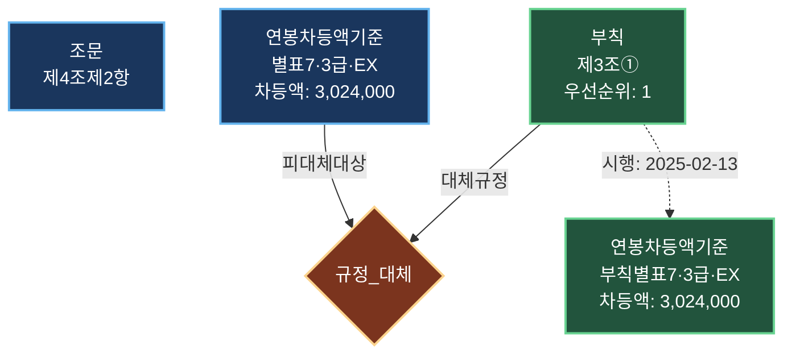

# 한국은행 보수규정 Knowledge Graph — 3-Way 아키텍처 비교

> **"같은 질문을 세 가지 방식으로 던지면, 어떤 아키텍처가 정확한 답을 내는가?"**

한국은행 보수규정(2025.2.13 전면개정) 전문을 기계가 읽을 수 있는 지식 그래프로 변환하고, 동일한 자연어 질문을 **Base LLM · Neo4j Graph RAG · TypeDB Knowledge Graph RAG** 세 경로에 동시에 통과시켜 **정확성·추론 과정·환각(hallucination) 정도**를 비교하는 프로젝트입니다.

---

## 1. 핵심 결과: 3-Way 비교 테스트

### 테스트 질문

```
3급 G3 종합기획직원 A가 다음 조건을 모두 충족할 때,
2025년 5월 1일 기준으로 적용되는 연봉제 본봉을 산정하시오.

조건:
1. 직전 연봉제 본봉: 60,000,000원
2. 성과평가 등급: 'EX'
```

이 질문이 어려운 이유: 단순 조회가 아니라 **별표7(연봉차등액표)에서 3급·EX에 해당하는 차등액 3,024,000원을 찾아** 직전 본봉에 더해야 합니다. 또한 2025년 부칙 제3조에 의해 별표7 원본이 부칙 경과조치로 **대체(override)** 되는 시점이므로, 규정 우선순위까지 이해해야 합니다.

### 결과

| 아키텍처 | 산출 금액 | 정답 여부 | 실패 원인 |
|:---------|----------:|:---------:|:----------|
| **Base LLM** (DB 없음) | 63,600,000원 | ❌ | "기본 증가율 2.0%" 등 근거 없는 수치를 추론에 사용 |
| **Neo4j Graph RAG** (Text-to-Cypher) | **63,024,000원** | ✅ | — |
| **TypeDB Knowledge Graph RAG** (Text-to-TypeQL) | **63,024,000원** | ✅ | — |

> **정답: 60,000,000 + 3,024,000 = 63,024,000원**

Graph RAG 두 경로는 DB에서 정확한 차등액(3,024,000원)을 조회한 뒤 산술 연산만 수행하므로 환각이 없습니다. Base LLM은 DB 없이 파라미터 지식만으로 답하기 때문에 존재하지 않는 증가율을 만들어냅니다.

```bash
# 직접 실행
PYTHONPATH=src python run_comparison.py
```

---

## 2. 왜 Knowledge Graph인가 — 규정의 구조적 특성

한국은행 보수규정은 단순한 텍스트 문서가 아닙니다. **조문(본문)**과 **별표(테이블)**, **부칙(경과조치)**, 그리고 **총재 의사결정**이 서로 참조·대체·무효화하는 **계층적 법률 구조**입니다.

```
┌─────────────────────────────────────────────────────────┐
│                    규정 (보수규정)                        │
│                                                         │
│  ┌──────────┐   참조    ┌──────────┐                    │
│  │ 조문(본문) │ ───────→ │ 별표(테이블) │                   │
│  │ 제4조제2항 │          │ 별표7      │                   │
│  │ "연봉차등액│          │ 3급·EX →   │                   │
│  │  은 별표7에│          │ 3,024,000원│                   │
│  │  의한다"   │          │            │                   │
│  └──────────┘          └─────┬────┘                    │
│                              │                          │
│                    ┌─────────▼─────────┐                │
│                    │   부칙 (2025년)     │                │
│                    │ 제3조: 별표7의 연봉  │                │
│                    │ 차등액은 이 부칙    │                 │
│                    │ 별표7에 의한다      │                 │
│                    │ (우선순위: 1)       │                 │
│                    └───────────────────┘                │
│                                                         │
│  ┌─────────────────────────────────────┐                │
│  │     총재 의사결정 (최상위 오버라이드)      │               │
│  │  "2025년 3급 EX 차등액을 별도 고시한다"   │               │
│  │  (우선순위: 0) — 모든 규정보다 우선       │               │
│  └─────────────────────────────────────┘                │
└─────────────────────────────────────────────────────────┘
```

이 구조를 텍스트 RAG로 처리하면 **"별표7에 의한다"라는 참조를 따라가지 못하고**, 부칙이 본문을 대체하는 시점 논리를 놓칩니다. Knowledge Graph는 이 관계를 **노드와 엣지로 명시적으로 모델링**하여 정확한 답을 보장합니다.

---

## 3. 규정 우선순위와 대체(Override) 스토리라인

### 3.1 등장인물: 규정의 네 계층

보수규정에는 네 종류의 규범 요소가 있으며, 각각 **적용 우선순위**가 다릅니다.

| 우선순위 | 규범 요소 | 역할 | 예시 |
|:--------:|:----------|:-----|:-----|
| 0 (최우선) | **총재 의사결정** | 규정·부칙 모두를 초월하는 최상위 결정 | "2025년도 3급 차등액을 별도 고시" |
| 1 | **부칙** (附則) | 본문·별표의 경과조치·시한부 대체 | 부칙 제3조: 별표7을 부칙 별표7로 대체 |
| 2 | **별표** (別表) | 본문 조문이 참조하는 수치 테이블 | 별표7: 연봉차등액표 |
| 3 | **조문** (본문) | 규정의 기본 골격 | 제4조제2항: "연봉차등액은 별표7에 의한다" |

### 3.2 시나리오: 2025년 5월, 3급 EX 연봉제 본봉

직원 A의 본봉을 산정하는 과정을 규정 우선순위에 따라 따라가 보겠습니다.

**Step 1 — 조문에서 출발**

> 제4조(연봉제 본봉) ② 연봉제 본봉의 차등액은 별표7에 의한다.

본문이 "별표7을 보라"고 지시합니다.

**Step 2 — 별표7 원본 확인**

별표7(연봉차등액표)에서 3급·EX 행을 찾으면:

| 직급 | 평가등급 | 차등액(천원/월) |
|:----:|:--------:|---------------:|
| 3급 | EX | 3,024 |

**Step 3 — 부칙이 끼어든다**

2025년 부칙 제3조 제1항:
> "제4조 제2항에 따른 연봉차등액은 이 부칙 별표7에 의한다."

부칙(우선순위 1)이 본문 별표7(우선순위 2)을 **대체**합니다. 시행일 2025-02-13부터 적용.

```
규정_대체 관계:
  대체규정  → 부칙 제3조
  피대체대상 → 별표7 각 항목 (12건)
  대체사유  → "2025년 부칙 별표7 경과조치"
  대체시행일 → 2025-02-13
```

**Step 4 — 부칙 별표7에서 최종 값 확인**

부칙 별표7도 동일한 3,024,000원을 규정합니다 (이 PoC에서는 값이 같지만, 실무에서는 다를 수 있음).

**Step 5 — 총재 의사결정 확인**

해당 시점에 별도의 총재 의사결정(우선순위 0)이 없으므로, 부칙 값이 최종 확정.

**최종 계산:**
```
직전 본봉       60,000,000원
+ 차등액       +  3,024,000원  ← 부칙 별표7에서 조회
────────────────────────────
= 새 본봉       63,024,000원
```

### 3.3 Knowledge Graph에서의 표현

이 우선순위 체계를 TypeDB 스키마에서는 다음과 같이 모델링합니다:



핵심은 **`규정_대체` 관계(relation)** 입니다. 이 관계가 `부칙`(대체규정)과 `별표7 항목`(피대체대상)을 연결하며, `대체시행일`과 `대체만료일`로 시간 범위를 제한합니다.

현재 DB에 적재된 데이터:
- **부칙**: 4건 (제1조 시행일, 제2조 보수경과조치, 제3조① 연봉제본봉경과조치, 제3조② 적용기간)
- **규정_대체**: 17건 (부칙→본문/별표 대체 관계)
- **부칙 별표7 데이터**: 12건 (연봉차등액기준 ADIFF-* 시리즈)

### 3.4 대체 대상이 되는 9개 엔티티 유형

`규정_대체:피대체대상` 역할을 수행할 수 있는 엔티티는 다음과 같습니다. 부칙은 조문뿐 아니라 모든 별표 데이터를 개별적으로 대체할 수 있습니다.

| 엔티티 | 대응 규정 요소 | 대체 예시 |
|:-------|:---------------|:----------|
| 조문 | 본문 조항 | 부칙이 제4조 내용을 변경 |
| 호봉 | 별표3~6 호봉표 | 부칙이 특정 호봉 금액을 변경 |
| 직책급기준 | 별표1-1 직책급표 | 부칙이 팀장 직책급을 변경 |
| 상여금기준 | 별표1-2 상여금표 | 부칙이 EX 상여금률을 변경 |
| 연봉차등액기준 | 별표7 차등액표 | 부칙이 3급·EX 차등액을 변경 |
| 연봉상한액기준 | 별표8 상한액표 | 부칙이 3급 상한액을 변경 |
| 임금피크제기준 | 별표9 지급률표 | 부칙이 2년차 지급률을 변경 |
| 국외본봉기준 | 별표1-5 해외본봉표 | 부칙이 미국 3급 본봉을 변경 |
| 초임호봉기준 | 별표2 초임호봉표 | 부칙이 G5 초임호봉을 변경 |

---

## 4. 비교 대상 아키텍처 요약

| 경로 | 구현 위치 | 핵심 기술 | 강점 | 약점 |
|:-----|:----------|:----------|:-----|:-----|
| **Base LLM** | `run_comparison.py` | vLLM + HyperCLOVAX | DB 불필요, 즉시 응답 | 수치 환각 불가피 |
| **Neo4j Graph RAG** | `src/bok_compensation_neo4j/` | Cypher + LPG | 쿼리 생성 안정적, 디버깅 편리 | 스키마 강제력 약함 |
| **TypeDB KG RAG** | `src/bok_compensation/` | TypeQL + 하이퍼그래프 | 엄격한 스키마, N-ary 관계 | TypeQL 생성 난이도 높음 |
| **Context** | `src/bok_compensation_context/` | 전처리 문서 + LLM | 규정 해석형에 빠름 | 계산·조인형 질의 취약 |

---

## 5. 자연어 질의 파이프라인

TypeDB와 Neo4j 경로는 동일한 파이프라인 구조를 따릅니다:

```
┌────────┐    ┌──────────────┐    ┌──────────────┐    ┌──────────┐
│ 자연어   │ →  │ classify_    │ →  │ rule-based   │ →  │ DB 실행   │
│ 질문     │    │ intent       │    │ plan or      │    │ + 답변    │
│          │    │ (Data/       │    │ LLM plan     │    │ 생성      │
│          │    │  Semantic)   │    │              │    │          │
└────────┘    └──────────────┘    └──────────────┘    └──────────┘
                    │                     │
                    │ Data 경로:           │ 규칙 매칭 → TypeQL/Cypher 템플릿
                    │ 산정/계산/            │ 매칭 실패 → LLM이 쿼리 자유 생성
                    │ 본봉/호봉 등          │
                    │                     │
                    │ Semantic 경로:       │
                    │ 조문 텍스트를         │
                    │ 읽고 LLM 해석        │
```

### 안정화 장치

- **`query_retrieval.py`**: 질문에서 intent(salary_calculation, salary_step_table 등)와 슬롯(직급, 평가등급) 추출
- **`query_rules.py`**: LLM 자유 생성 전에 규칙 기반 TypeQL/Cypher 템플릿 우선 적용
- **`live_catalog.py`**: 실제 DB에서 바인딩 가능한 값(직급코드, 직위코드 등) 추출
- **`classify_intent`**: "산정", "본봉", "차등액" 등 수치 키워드를 감지하면 Data 경로로 라우팅

---

## 6. 프로젝트 구조

```text
bok-compensation-regulations/
├── run_comparison.py                 # 3-Way 비교 테스트 실행 스크립트
├── src/
│   ├── bok_compensation/             # TypeDB 구현
│   │   ├── nl_query.py               #   자연어 → TypeQL → 실행 → 답변
│   │   ├── query_rules.py            #   규칙 기반 쿼리 템플릿
│   │   ├── query_retrieval.py        #   intent·슬롯 추출 엔진
│   │   ├── live_catalog.py           #   DB 실시간 값 바인딩
│   │   ├── insert_data.py            #   전체 데이터 적재 (21단계)
│   │   └── langgraph_query.py        #   LangGraph 기반 실행
│   ├── bok_compensation_neo4j/       # Neo4j 구현
│   └── bok_compensation_context/     # Context 비교 구현
├── schema/
│   └── compensation_regulation.tql   # TypeDB 스키마 (부칙·규정_대체 포함)
├── docs/
│   ├── schema_diagram.md             # TypeDB 스키마 다이어그램
│   ├── neo4j_schema_diagram.md       # Neo4j 스키마 다이어그램
│   └── neo4j_browser_queries.md      # Neo4j 브라우저 질의 모음
├── tests/
│   ├── validate_data.py              # TypeDB·Neo4j 데이터 정합성 검증
│   ├── test_nl_pipeline.py           # 3경로 비교 자동화 테스트
│   ├── test_query_rules.py           # 규칙 엔진 단위 테스트
│   └── test_nl_router.py             # 라우팅 단위 테스트
├── pyproject.toml
└── README.md
```

---

## 7. 데이터 범주

| 범주 | 근거 조문/별표 | 예시 데이터 |
|:-----|:---------------|:------------|
| 조문·규정 해석 | 제1조~제22조 | 기한부 고용계약자 상여금 가능 여부 |
| 호봉·본봉 | 별표3~6 | 3급 50호봉: 77,724,000원 |
| 직책급 | 별표1-1 | 3급 팀장: 1,500,000원 |
| 상여금 지급률 | 별표1-2 | 팀장·EX: 100% |
| 연봉차등액 | 별표7 | 3급·EX: 3,024,000원 |
| 연봉상한액 | 별표8 | 3급: 77,724,000원 |
| 임금피크제 | 별표9 | 2년차 80% |
| 국외본봉 | 별표1-5 | 미국·3급: 8,620 USD |
| 초임호봉 | 별표2 | G5 종합기획직원: 1호봉 |
| 개정이력 | 부칙 | 2025-02-13 전면개정 |
| **부칙·대체관계** | 부칙 제1~3조 | 부칙→별표7 대체 17건 |

---

## 8. 빠른 시작

### 사전 요구사항

| 구성 요소 | 버전 | 용도 |
|:----------|:-----|:-----|
| Python | 3.9+ | 런타임 |
| TypeDB Server | 3.x | 구조화 그래프 DB |
| Neo4j | 5.x Community | LPG 그래프 DB |
| Docker | 최신 | 컨테이너 실행 |
| LLM endpoint | OpenAI-compatible | 자연어 질의 |

### 컨테이너 실행

```bash
# TypeDB
docker run -d --name typedb \
  -p 1729:1729 -p 8000:8000 \
  typedb/typedb:latest

# Neo4j
docker run -d --name neo4j \
  -p 7474:7474 -p 7687:7687 \
  -e NEO4J_AUTH=neo4j/password \
  neo4j:5-community
```

### Python 환경

```bash
python3 -m venv .venv
source .venv/bin/activate
pip install -e .[dev,neo4j,llm]
```

### 데이터 적재

```bash
# TypeDB (스키마 → 데이터 21단계 자동 적재)
PYTHONPATH=src python -m bok_compensation.create_db
PYTHONPATH=src python -m bok_compensation.insert_data

# Neo4j
PYTHONPATH=src python -m bok_compensation_neo4j.create_schema
PYTHONPATH=src python -m bok_compensation_neo4j.insert_data
```

### LLM 설정

```bash
export LLM_PROVIDER=openai-compatible
export OPENAI_BASE_URL=http://127.0.0.1:9999/v1
export OPENAI_MODEL=HyperCLOVAX-SEED-Think-32B
```

### 3-Way 비교 실행

```bash
PYTHONPATH=src python run_comparison.py
```

---

## 9. 검증 명령

```bash
# 데이터 정합성 (TypeDB 101건 + 부칙 4건 + 규정_대체 17건)
PYTHONPATH=src python tests/validate_data.py all

# 규칙 엔진 단위 테스트
PYTHONPATH=src python -m pytest tests/test_query_rules.py -q

# 개별 경로 스모크 테스트
PYTHONPATH=src python -m bok_compensation.langgraph_query "G5 직원의 초봉은?"
PYTHONPATH=src python -m bok_compensation_neo4j.langgraph_query "G5 직원의 초봉은?"

# 세 경로 비교표
PYTHONPATH=src python tests/test_nl_pipeline.py compare
```

---

## 10. 질문 유형별 아키텍처 적합성

| 질문 유형 | Base LLM | Neo4j | TypeDB | Context |
|:----------|:--------:|:-----:|:------:|:-------:|
| 수치 조회 (호봉, 차등액) | ❌ | ✅ | ✅ | △ |
| 복합 산정 (본봉 = 직전 + 차등액) | ❌ | ✅ | ✅ | ❌ |
| 규정 해석 ("~을 받을 수 있어?") | △ | △ | △ | ✅ |
| 부칙 대체 추적 | ❌ | ✅ | ✅ | ❌ |
| 모델 정합성 검증 | ❌ | △ | ✅ | ❌ |
| LLM 쿼리 생성 안정성 | — | ✅ | △ | — |

---

## 11. 환경 변수

| 변수 | 기본값 | 설명 |
|:-----|:-------|:-----|
| `TYPEDB_ADDRESS` | `localhost:1729` | TypeDB 서버 주소 |
| `TYPEDB_DATABASE` | `bok-compensation-regulations` | TypeDB 데이터베이스명 |
| `NEO4J_URI` | `bolt://localhost:7687` | Neo4j Bolt 주소 |
| `NEO4J_USERNAME` / `NEO4J_PASSWORD` | `neo4j` / `password` | Neo4j 인증 |
| `LLM_PROVIDER` | `openai-compatible` | `openai-compatible` 또는 `ollama` |
| `OPENAI_BASE_URL` | — | OpenAI 호환 API 주소 |
| `OPENAI_MODEL` | — | 사용 모델명 |
| `BOK_USE_LIVE_CATALOG` | `1` | DB 실시간 값 바인딩 사용 |
| `BOK_USE_KEY_BINDING` | `1` | 규칙 행 key binding 사용 |
| `BOK_QUERY_TRACE_DIR` | (미설정) | 쿼리 trace JSON 저장 경로 |

---

## 12. 참고 문서

- [TypeDB 스키마 다이어그램](docs/schema_diagram.md)
- [Neo4j 스키마 다이어그램](docs/neo4j_schema_diagram.md)
- [Neo4j 브라우저용 질의](docs/neo4j_browser_queries.md)
- [프로젝트 부트스트랩 메모](docs/project_bootstrap_prompt.md)

---

## 13. 한계와 향후 과제

- **총재 의사결정 레이어**: 현재 스키마에 우선순위 0으로 설계는 되어 있으나, 실제 데이터는 미적재. 향후 총재 의사결정 → 규정_대체 관계를 추가하면 완전한 4단계 우선순위 체계 구현 가능.
- **시간축 질의**: "2024년 12월 기준 vs 2025년 5월 기준"처럼 시점에 따라 적용 규정이 달라지는 질의는 `대체시행일`/`대체만료일`로 필터링 가능하나, 파이프라인 자동 적용은 향후 과제.
- **복합 산술**: 직책급 + 상여금 + 차등액 + 상한 검증 등 4개 이상의 별표를 조인하는 복합 질의는 규칙 템플릿 확장이 필요.
- **LLM TypeQL 생성**: TypeDB 3.x TypeQL은 LLM이 자유 생성하기 어려운 구문이므로, 규칙 기반 플래너 의존도가 높음.
