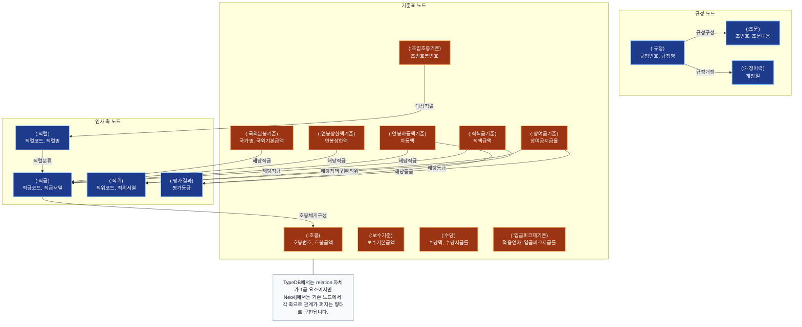

# 한국은행 보수규정 지식 그래프 (Neo4j LPG 대응도)

이 문서는 TypeDB 스키마가 Neo4j에서는 어떻게 펼쳐지는지 보여주는 대응 다이어그램입니다.

- TypeDB의 엔티티는 Neo4j 노드 레이블로 매핑됩니다.
- TypeDB의 N-ary relation은 Neo4j에서 중심 기준 노드와 여러 관계선으로 분해됩니다.
- 따라서 질의 흐름은 더 직선적으로 보이지만, 관계 의미는 애플리케이션 쿼리에서 보존해야 합니다.

## 읽는 방법

1. 파란 노드는 축 노드 또는 문서 노드입니다. `직급`, `직위`, `평가결과`, `직렬`이 여기에 해당합니다.
2. 주황 노드는 실제 금액/지급률/기준값을 가진 중심 노드입니다.
3. TypeDB의 `직책급결정(적용기준, 해당직급, 해당직위)`은 Neo4j에서 `(:직책급기준)-[:해당직급]->(:직급)` 과 `(:직책급기준)-[:해당직위]->(:직위)` 두 관계로 분해됩니다.
4. 그래서 Neo4j는 탐색은 단순하지만, 관계 의미를 쿼리에서 정확히 묶어야 합니다.

## TypeDB와 읽는 차이

| 관점 | TypeDB | Neo4j |
|------|--------|-------|
| 관계 표현 | relation 자체가 중심 | 기준 노드가 중심 |
| 질문 읽는 방식 | relation 역할을 찾는다 | 기준 노드에서 연결된 축을 찾는다 |
| 강점 | 의미 보존이 엄격함 | 시각화와 탐색이 직관적임 |

## 예시 질의 해석

`3급 팀장 EX 평가 상여금`을 읽을 때는 아래처럼 봅니다.

1. 기준 노드는 `(:상여금기준)` 입니다.
2. 여기에 `[:해당직책구분] -> (:직위 {직위명: '팀장'})` 이 연결됩니다.
3. 동시에 `[:해당등급] -> (:평가결과 {평가등급: 'EX'})` 이 연결됩니다.
4. 그 노드의 `상여금지급률` 속성을 읽으면 됩니다.