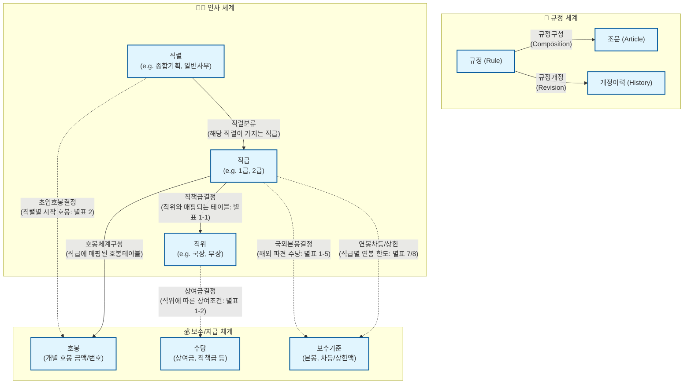

# 한국은행 보수규정 지식 그래프 (TypeDB Schema)

```mermaid
graph TD
    %% Styling
    classDef entity fill:#e1f5fe,stroke:#01579b,stroke-width:2px;
    classDef relation fill:#fff3e0,stroke:#e65100,stroke-width:2px,stroke-dasharray: 5 5;

    %% --------------------------------
    %% 1. 규정 체계 (Regulation System)
    %% --------------------------------
    subgraph 규정_체계["📜 규정 체계"]
        Regulation["규정 (Rule)"]:::entity
        Article["조문 (Article)"]:::entity
        History["개정이력 (History)"]:::entity
        
        Regulation -- "규정구성\n(Composition)" --> Article
        Regulation -- "규정개정\n(Revision)" --> History
    end

    %% --------------------------------
    %% 2. 인사 체계 (HR System)
    %% --------------------------------
    subgraph 인사_체계["🧑‍💼 인사 체계"]
        JobGroup["직렬\n(e.g. 종합기획, 일반사무)"]:::entity
        Rank["직급\n(e.g. 1급, 2급)"]:::entity
        Position["직위\n(e.g. 국장, 부장)"]:::entity
        
        JobGroup -- "직렬분류\n(해당 직렬이 가지는 직급)" --> Rank
    end

    %% --------------------------------
    %% 3. 보수 체계 (Compensation System)
    %% --------------------------------
    subgraph 보수_체계["💰 보수/지급 체계"]
        PayStep["호봉\n(개별 호봉 금액/번호)"]:::entity
        Allowance["수당\n(상여금, 직책급 등)"]:::entity
        BasePay["보수기준\n(본봉, 차등/상한액)"]:::entity
    end

    %% --------------------------------
    %% 4. 테이블(별표) 기반 핵심 매핑 (Relations)
    %% --------------------------------
    Rank -- "호봉체계구성\n(직급에 매핑된 호봉테이블)" --> PayStep
    Rank -- "직책급결정\n(직위와 매핑되는 테이블: 별표 1-1)" --> Position
    JobGroup -. "초임호봉결정\n(직렬별 시작 호봉: 별표 2)" .-> PayStep
    Position -. "상여금결정\n(직위에 따른 상여조건: 별표 1-2)" .-> Allowance
    Rank -. "연봉차등/상한\n(직급별 연봉 한도: 별표 7/8)" .-> BasePay
    Rank -. "국외본봉결정\n(해외 파견 수당: 별표 1-5)" .-> BasePay

```