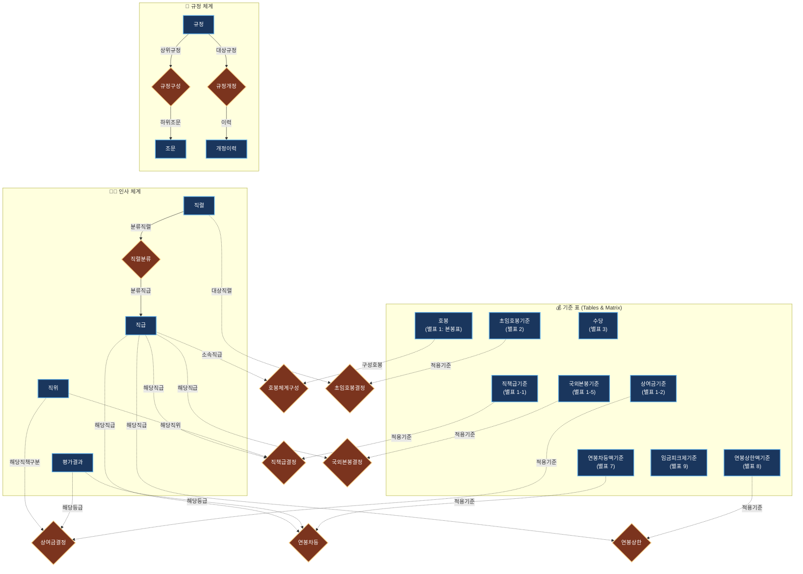

# 한국은행 보수규정 지식 그래프 (TypeDB N-ary 하이퍼그래프)

```mermaid
flowchart TD
    %% 다크 모드/라이트 모드 고대비 색상 (마름모: Relation, 네모: Entity)
    classDef entity fill:#1a365d,stroke:#63b3ed,stroke-width:2px,color:#ffffff;
    classDef relation fill:#7b341e,stroke:#fbd38d,stroke-width:2px,color:#ffffff,shape:diamond;

    %% --------------------------------
    %% 1. 규정 체계 (Regulation System)
    %% --------------------------------
    subgraph 규정_체계["📜 규정 체계"]
        direction TB
        Regulation["규정"]:::entity
        Rel_Comp{"규정구성"}:::relation
        Article["조문"]:::entity
        
        Rel_Rev{"규정개정"}:::relation
        History["개정이력"]:::entity

        Regulation -->|상위규정| Rel_Comp -->|하위조문| Article
        Regulation -->|대상규정| Rel_Rev -->|이력| History
    end

    %% --------------------------------
    %% 2. 인사 체계 (HR System)
    %% --------------------------------
    subgraph 인사_체계["🧑‍💼 인사 체계"]
        direction TB
        JobGroup["직렬"]:::entity
        Rel_Class{"직렬분류"}:::relation
        Rank["직급"]:::entity
        Position["직위"]:::entity
        Eval["평가결과"]:::entity
        
        JobGroup -->|분류직렬| Rel_Class -->|분류직급| Rank
        Rank ~~~ Position
        Position ~~~ Eval
    end

    %% --------------------------------
    %% 3. 보수 산정 기준 엔티티 (모든 표/별표 매핑)
    %% --------------------------------
    subgraph 보수_체계["💰 기준 표 (Tables & Matrix)"]
        direction TB
        PayStep["호봉\n(별표 1: 본봉표)"]:::entity
        InitStepStd["초임호봉기준\n(별표 2)"]:::entity
        Allowance["수당\n(별표 3)"]:::entity
        
        PosPayStd["직책급기준\n(별표 1-1)"]:::entity
        BonusStd["상여금기준\n(별표 1-2)"]:::entity
        OverseasStd["국외본봉기준\n(별표 1-5)"]:::entity
        
        SalDiffStd["연봉차등액기준\n(별표 7)"]:::entity
        SalCapStd["연봉상한액기준\n(별표 8)"]:::entity
        WagePeakStd["임금피크제기준\n(별표 9)"]:::entity

        %% 가로로 너무 퍼지지 않게 세로 정렬 유도
        PayStep ~~~ PosPayStd ~~~ SalDiffStd
        InitStepStd ~~~ BonusStd ~~~ SalCapStd
        Allowance ~~~ OverseasStd ~~~ WagePeakStd
    end

    %% 서브그래프 간의 수직적 흐름 유도 (보이지 않는 선)
    규정_체계 ~~~ 인사_체계
    인사_체계 ~~~ 보수_체계

    %% --------------------------------
    %% 4. N-ary(다항) 하이퍼그래프 릴레이션 매핑
    %% --------------------------------
    Rel_PayStep{"호봉체계구성"}:::relation
    Rank -.->|소속직급| Rel_PayStep
    PayStep -.->|구성호봉| Rel_PayStep

    Rel_InitStep{"초임호봉결정"}:::relation
    JobGroup -.->|대상직렬| Rel_InitStep
    InitStepStd -.->|적용기준| Rel_InitStep

    Rel_PositionPay{"직책급결정"}:::relation
    Rank -.->|해당직급| Rel_PositionPay
    Position -.->|해당직위| Rel_PositionPay
    PosPayStd -.->|적용기준| Rel_PositionPay

    Rel_Bonus{"상여금결정"}:::relation
    Position -.->|해당직책구분| Rel_Bonus
    Eval -.->|해당등급| Rel_Bonus
    BonusStd -.->|적용기준| Rel_Bonus

    Rel_SalDiff{"연봉차등"}:::relation
    Rank -.->|해당직급| Rel_SalDiff
    Eval -.->|해당등급| Rel_SalDiff
    SalDiffStd -.->|적용기준| Rel_SalDiff

    Rel_SalCap{"연봉상한"}:::relation
    Rank -.->|해당직급| Rel_SalCap
    SalCapStd -.->|적용기준| Rel_SalCap

    Rel_Overseas{"국외본봉결정"}:::relation
    Rank -.->|해당직급| Rel_Overseas
    OverseasStd -.->|적용기준| Rel_Overseas
```