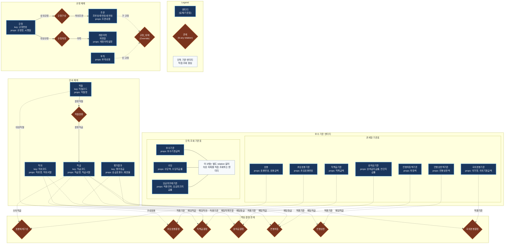
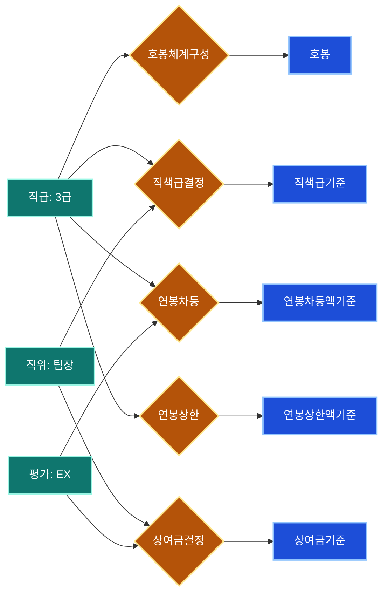
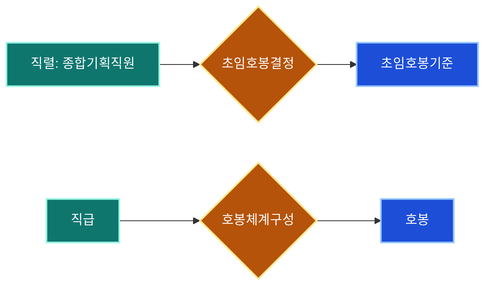
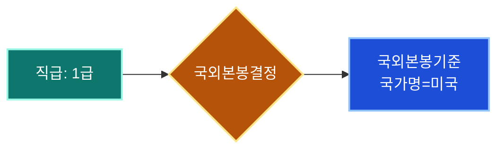

# 한국은행 보수규정 지식 그래프 (TypeDB N-ary 하이퍼그래프)

이 문서는 TypeDB 스키마를 사람이 빠르게 읽기 위한 해설용 다이어그램입니다.

- 위쪽 메인 다이어그램: 전체 구조
- 중간 속성 요약: 엔티티별 핵심 속성
- 아래 질의 경로 다이어그램: 실제 질문이 어떤 relation을 타는지 예시

## 읽는 방법

1. 위에서 아래로 읽습니다. `규정 체계`는 법문 구조, `인사 체계`는 사람 분류 축, `보수 기준 엔티티`는 금액/지급률 표입니다.
2. 마름모는 계산 또는 매핑 규칙이 들어가는 관계입니다. 예를 들어 `직책급결정`은 `직급 + 직위 + 직책급기준`을 한 번에 묶습니다.
3. `단독 조회 기준표`는 별도 relation 없이 속성만 직접 읽는 lookup 엔티티입니다. `보수기준`, `수당`, `임금피크제기준`이 여기에 해당합니다.
4. 질문을 스키마에 대응시킬 때는 먼저 기준 엔티티를 찾고, 그 다음 관계 마름모를 따라 필요한 축(`직급`, `직위`, `평가결과`, `직렬`)을 붙이면 됩니다.

## 엔티티 빠른 해설

| 구역 | 엔티티 | 핵심 속성 | 읽는 포인트 |
|------|--------|-----------|-------------|
| 규정 체계 | 규정 | `규정번호`, `규정명`, `시행일` | 전체 문서의 루트입니다. |
| 규정 체계 | 조문 | `조번호`, `항번호`, `호번호`, `조문내용` | 규정 해석 질의의 컨텍스트 원문입니다. |
| 규정 체계 | 부칙 | `부칙내용` | 경과조치 등 예외 사항이며 `규정_대체`를 통해 조문을 오버라이드합니다. |
| 인사 체계 | 직렬 | `직렬코드`, `직렬명` | 초임호봉 결정의 출발 축입니다. |
| 인사 체계 | 직급 | `직급코드`, `직급명`, `직급서열` | 본봉, 직책급, 연봉차등, 상한, 국외본봉의 공통 축입니다. |
| 인사 체계 | 직위 | `직위코드`, `직위명`, `직위서열` | 직책급, 상여금의 공통 축입니다. |
| 인사 체계 | 평가결과 | `평가등급`, `승급호봉수`, `배분율` | 상여금과 연봉차등의 공통 축입니다. |
| 기준표 | 호봉 | `호봉번호`, `호봉금액` | 직급별 본봉표의 실제 금액 행입니다. |
| 기준표 | 직책급기준 | `직책급액` | `직급 + 직위` 조합으로 결정됩니다. |
| 기준표 | 상여금기준 | `상여금지급률`, `연간지급률` | `직위 + 평가등급` 조합으로 결정됩니다. |
| 기준표 | 연봉차등액기준 | `차등액` | `직급 + 평가등급` 조합으로 결정됩니다. |
| 기준표 | 연봉상한액기준 | `연봉상한액` | 직급별 상한 lookup 입니다. |
| 기준표 | 국외본봉기준 | `국가명`, `국외기본급액`, `통화단위` | `국가 + 직급` 기준표입니다. |
| 단독 조회 | 보수기준 | `보수기본급액` | 임원급 기본 보수표입니다. |
| 단독 조회 | 수당 | `수당액`, `수당지급률`, `지급조건` | relation 없이 조건/금액을 직접 읽습니다. |
| 단독 조회 | 임금피크제기준 | `적용연차`, `임금피크지급률` | 연차별 지급률 lookup 입니다. |

## 질의 경로 예시

### 1. 3급 팀장 EX 평가 총보수 질의 경로

### 2. 종합기획직렬 초임호봉 질의 경로

### 3. 미국 1급 국외본봉 질의 경로

## 해석 팁

1. 금액/지급률 질의는 먼저 어떤 기준표를 읽는지 찾고, 그 기준표를 relation이 요구하는 축으로 역추적하면 됩니다.
2. `직급 + 직위`, `직위 + 평가등급`, `직급 + 평가등급`처럼 축이 2개 이상이면 거의 항상 relation 마름모를 거칩니다.
3. 반대로 `보수기준`, `수당`, `임금피크제기준`처럼 엔티티 자체 속성을 직접 읽는 경우는 relation이 필요 없습니다.
4. 조문 해석 질의는 금액 표보다 `규정 -> 조문` 구조가 핵심이며, NL 파이프라인도 이 구조를 컨텍스트로 사용합니다.